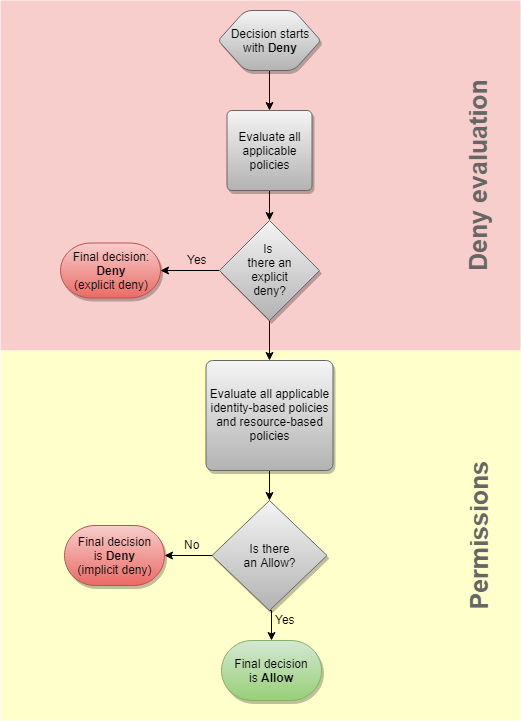

## IAM
* Identity Access Management, a Global Service (Not scoped to a region)
* It is not the best practice to use the root account, or share the account for accessing AWS
* It is preferred to create users in IAM and give the users, permissions
* IAM permissions are nothing but JSON policies attached to Users or Groups
    * An inline-policy is the policy directly attached to a user 
* Groups are formed by grouping users together
    * A user can belong to multiple groups
    * At the same time, it is also not necessary that a user should belong to a group
    * A user part of a group will inherit policies attached to that group and also other policies of the groups that he is a part of
    * A group can contain only users, not other groups
* In AWS, we apply the _least previlige principle_, you dont give a user more than what he needs

## IAM Policy Structure
* An IAM policy consists of the following lines: 
    * Version: Policy language version
    * Id: Identifier for the policy (optional)
    * Statement: A list of statements

* Each Statement consists of following lines
    * Sid: Statement ID (Optional)
    * Effect: Allow/Deny; Allows or Denies the specified action
    * Principal: account/user/role to whom the policy applies to
    * Action: List of actions that the policy allows the principal to perform
    * Resource: Resource on which the actions are performed 
    * Condition: Conditions on when the policy should be active (optional)
> a
## Securing AWS Accounts
* There are two mechanisms for securing your AWS accounts
* First one, is to create a strong password policy
    * Password policy is nothing but mentioning how the passwords should be created for the IAM users, ie- 1 uppercase, 1 Lowercase, 1 symbol ...
    * In the password policy, you can enable password expiration aswell, ie- the users need to change the password after N days
    * You also have the option to prevent the re-use of passwords
* Second method is enabling MFA
    * In Multi-Factor Authentication, you need to have access to another "device" along with the regular password for you to be able to login to your account
    * So, the advantage here is that, even if the password is leaked, the account will not be compromised because the MFA device is with the user
    * MFA Options:
        * Virtual MFA Device: Google Authenticator (for phone only), Authy (multi-device)
        * U2F Key (looks like an USB): One key for root account, and IAM users aswell
        * Hardware key Fob MFA Device
        * Hardware Key fob AWS GovCloud(US)

## AWS CLI and AWS SDK
* You can access AWS in three possible ways
    * AWS Management Console (protected by password + MFA)
    * AWS CLI (protected by access keys)
    * AWS SDK (protected by access keys)

* Access keys are generated from the AWS console and should not be shared
    * Access key ID ~= username
    * Secret Acess Key ~= password

* AWS CLI is a tool that allows users to access AWS through the command line. It also provides access to the public APIs provided by AWS services

* AWS SDK (Software Development Kit) is a set of libraries embedded in your application that provides access to AWS. 
    * Other than programming languages it also supports Mobile SDKs and IoT SDKs

## AWS CloudShell 
* Cloudshell is a terminal in AWS console that is free to use
* All the files that is created in the cloudshell environment is retained even when cloudShell is restarted
* You can upload/download files from/to the CloudShell environment
> Don't confuse this with EC2 instance connect

## IAM Roles
* An IAM Role is created for AWS Services to use AWS resources on our behalf
* A policy is attached to an IAM role to give the required permissions
* Then the IAM role is associated with an AWS Service. For example,
    * EC2 Instance Roles

## IAM Security Tools
* IAM Credentials Report (account-level)
    * Shows the list of users and status of their credentials
* IAM Access Advisor (user-level)
    * SHows the services that has been acessed by ther users and when they were last accessed
    * Used to revise IAM policies if needed (applying _least privilege principle_)

## IAM Best Practices
* Use root account only for account setup 
* Create IAM users for different users and not share root user credentials anytime
* Use strong password policy and enable MFA
* Assign Users to groups and add permissions to groups rather than assigning permissions directly to the user
* Audit (analayze) permissions of your account using Credentials Report

## Extra Notes
  
* Explicit DENY: When there is a DENY statement in the policy
* Implicit DENY: When a DENY statement is not present but at the same time an ALLOW is not present aswell
