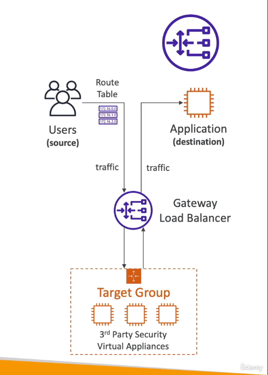
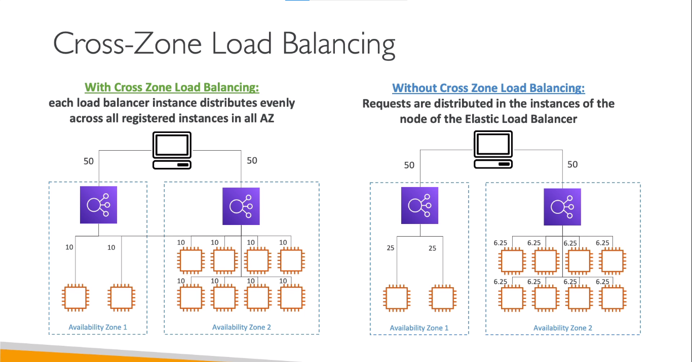
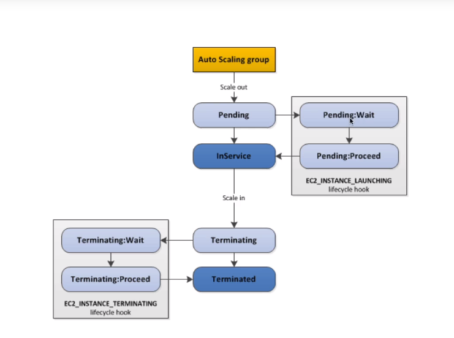

## Scalability and High Availability
* A system is said to be scalable if it can handle greater loads by adapting
### Vertical Scaling
* Increasing the size of the instances (ie- increase in RAM and vCPUs )
* Ex: from t2.micro to t3.2xlarge (doesn't have to be the same instance family)
* In vertical scaling, you scale up/down
* Vertical scaling usually happens in databases, to handle high workloads as your application grows
### Horizontal Scaling (aka Elasticity)
* Increasing the no. of instances
* In horizontal scaling, you scale out/in
* Ex: ASG scaling out EC2 instances to match increased workload for your web application
### High Availability
* An application is said to be highly available if it is running on multiple AZs
* The goal of high availability is to survive a data centre loss

## Elasting Load Balancing (ELB)
* Load balancers are servers that balance the load (or traffic) it receives, among the backend EC2 instances (or servers) in multiple AZs
    * It exposes as a single point of access (DNS) for the users
    * It performs health checks.   
    * It allows to seamlessly handle failure of instances (by only forwarding traffic to healthy EC2 instances)
    * Can enforce stickiness with cookies
* You can also set up your own Load balancer in AWS which doesn't cost much but it you need to put more effort
* An Elastic Load Balancer is an AWS managed Load balancer. So, AWS takes care of the upgrades and maintenance. And it is integrated with a ton of AWS services
* ELB performs health checks using specific **protocols** (HTTP,TCP..) on specific **ports** (80, 443..) and **route** (/login, /home..) expecting a response (200 status code). If the EC2 instance is able to reply, then it is considered as a healthy instance
* There are 4 types of ELBs
    * Classic Load Balancer (old generation)
        * Supports HTTP, HTTPS, TCP, SSL (secure TCP) Protocols
    * Application Load Balancer (new gen)
        * Supports HTTP, HTTPS, WebSocket Protocols
    * Network Load Balancer (new gen)   
        * Supports TCP, TLS (Secure TCP), UDP 
    * Gateway Load Balancer
        * Operates on Network Layer (Layer 3). Uses IP
* It is also possible to set up ELBs for internal and external use 
* The EC2 instances running behind the ELB only receive traffic from ELB. 
    * So the SGs of EC2 instances is configured referencing the SG of ELB to only allow traffic from it

## Classic Load Balancer
* Supports TCP (Layer 4) and HTTP, HTTPS (Layer 7)
* Uses TCP or HTTP based health checks
* Provides fixed hostname

## Application Load Balancer (ALB)
* Runs on Layer 7 (HTTP)
* Support for HTTP/2 and WebSocket
* Supports redirects (ex: HTTP -> HTTPS)
* Provides DNS hostname
* Suitable for microservices and container based applications (like Docker & Amazon ECS)
    * ALB provides a port mapping feature to redirect to a dynamic port in ECS
  
* You can use an Application Load Balancer:
    * as a load balancer for multiple applications running across multiple target-groups
    * as a load balancer for multiple applications/containers in the same machine
> You need to create multiple LBs for the same application if you use CLB

  
* The ALB can route traffic to a target-group based on:
    * routes (/home, /login..)
    * hostnames (asif.techin48.com, ash.techin48.com..)
    * Query strings, headers(tech48.com/signin?platform=mobile)
    * ALB balances the load among instances in the specific target-group
  
* Target group is a group of instances to which the ALB can route the traffic to 
    * Target groups can run an application regardless of what other target groups are running
    * A target-group can be a group of EC2 instances, ECS tasks, Lambda functions, IP addresses (private IPs)
  
* Health checks in ALB happens at target-group level
  
* The backend servers (EC2 instances) running behind the ALB don't have access to the client IP. But they can be found in the headers of the HTTP request (from the ALB to the machine)
    * `X-forwarded-for` contains client IP
    * `X-forwarded-port` contains the port
    * `X-forwarded-proto` contains the protocol

## Network Load Balancer
* Layer 4 load balancer 
* Handles millions of request per second
* Low-latency (ALB has slightly higher latency)
* Provides the feature to have a static IP per AZ (Elastic IP)
    * Helpful for whitelisting IPs

  
* A target group in an NLB can consist of   
    * EC2 instances
    * IP address
        * Must be static private IP; Useful when using servers in own data centre
    * Application Load Balancers
        * You can chain NLBs with ALBs to leverage the static IP feature of NLB along with HTTP functionalities from ALB

## Gateway Load Balancer 
* Layer 3 Load Balancer
* This is actually used to host 3rd party virtual appliances that filters all of your network traffic and checks for intruders before the traffic enters your application
* THis basically consists of two components:
    * Transparent Network Gateway: The gateway that acts a point of entry/exit for all the traffic
    * Load Balancer: Distributes traffic across 3rd party appliances (not the actual application)
  
* Target group can consist of EC2 instances and private IPs
* GLB uses *GENEVE* protocol on port 6081

  

## Sticky Sessions (Session Affinity)
* It is a feature in ALB and CLB that redirects the user to the same EC2 instance again and again 
* You use sticky sessions when you need to store session data (using cookies)
* The cookie used for stickines contains an expiration date that you control
* Using sticky sessions may create load imbalance among the instances
### Two types of cookies:
* Application based cookies
    * Custom application cookie
        * Generated by your application 
        * Can have custom attributes
        * Need to have own cookie name for each target group
        * Cannot use `AWSALB`, `AWSALBAPP`, `AWSALBTG` for cookie names
    * Encrypted Application Cookie
        * generated by load balancer
        * cookie name: `AWSALBAPP`
    * The load balancer sends both cookies, the custom cookie set by the target, and the application cookie generated by the load balancer, in the response to the client.
* Duration based cookies
    * Generated by the load balancer
    * Cookie names: `AWSALB` for ALB; `AWSELB` for CLB
> https://docs.aws.amazon.com/elasticloadbalancing/latest/application/sticky-sessions.html

## Cross Zone Load Balancing
* When you enable an Availability Zone for your load balancer, Elastic Load Balancing creates a load balancer node in the Availability Zone
* When cross-zone load balancing is disabled, each load balancer node distributes traffic only across the registered targets in its Availability Zone
* When cross-zone load balancing is enabled, each load balancer node distributes traffic across the registered targets in all enabled Availability Zones

  
* ALB
    * Enabled by default. Cannot disable it
    * Not charges for data transfer between AZs (inter AZ data transfer)
* CLB
    * Enabled by default. Can disable it
    * Not charged for data transfer between AZs
* NLB
    * Disabled by default. Can enable it
    * Charged for data transfer between AZs

## SSL Certificates
* SSL -> Secure Socket Layer; TLS -> Transport Layer Security (Newer version of SSL)
* SSL certificates are attached to the ELBs which is then used to encrypt traffic between the client and the load balancer (in-flight encryption)
* Public SSL certificates are issued by Certificate Authorities (CA) like GoDaddy
* SSL certificates have a expiration date that you set and must be renewed regularly 
* The load balancer uses the X.509 certificate
* You can upload and manage your own certificates in AWS Certificate Manager (ACM)
  
* When you create a HTTPS listener, you:
    * Must specify a default certificate
    * Can sepcify optional list of certificates to support multiple domains
    * can specify Security policies to support older versions of TLS/SSL    
### SNI
* Server Name Indication
* SNI allows you to expose multiple HTTPS applications each with its own SSL certificate on the same listener
* SNI is used by client to load the right SSL certificate for the hostname it wants to connect, from multiple hostnames in the webserver
* Only works for ALB, NLB and CloudFront. Not for CLB
  
* CLB
    * Can host only one SSL certificate
    * Need to create multiple CLBs for multiple hostnames with multiple SSL certificates
* ALB (or) NLB
    * Can host multiple SSL certificates
    * Uses SNI for accessing the right certificate

## Connection Draining
* Connection Draining is when the load balancers wait for the in-flight connection (connection between the client and the EC2 instance) to complete before de-registering the instance from the target group 
* During the _draining_ period, no new connections are sent to the EC2 instances by the load balancer
* The duration for the draining period is set to 300s by default, however you can specify any value from 1s-3600s
* It is called _**connection draining**_ in CLB and _**deregistration delay**_ in ALB and NLB

## Auto Scaling Group (ASG)
* The primary goal of ASG is to:
    * Scale out EC2 instances (to match increase workload)
    * Scale in EC2 instances (to match decereased workload)
* ASG makes use of the ELB healthchecks and replaces unhealthy instances with new ones
    * ASG uses EC2 healthchecks by default but also have the option to enable ELB healthchecks
* It automatically registers the new instances with the load balancers if you have set up LBs
* To create an ASG, you need to specify:
    * The launch template for your EC2 instances (AMI, OS, SG...)
    * Scaling policy
    * Desired capacity, minimum capacity and maximum capacity of EC2 instances
* ASG can also be triggered by CloudWatch alarms for any metric like CPU uilization or even a custom metric

## ASG Scaling Policies
### Dynamic Scaling Policies
* Target Tracking Policy
    * Tracks a specific metric and scales accordingly
    * For ex: The scaling policy tracks the Avg. CPU utilization among all instances and scales out if the metric reaches more than 70%
    * Target Tracking Policy creates CloudWatch Alarms internally
* Simple/Step Scaling
    * Adds/Removes 'n' number of instances. Step Scaling.
    * For ex: If CloudWatch Alarm triggers (for CPU utilization > 70%), add 2 units
    * If CloudWatch Alarm triggers (for CPU utilization < 40%), remove 1 unit
* Scheduled actions
    * Scales out/in based on usage patterns
    * Ex: Scaling out to specified capacity at 9am to 5pm every Sunday
### Predictive Scaling
* Scales according to a forecast that is created from previous data
* So, here.. scaling actions happen ahead of time

### Scaling cooldown   
* After a scaling activity by ASG, the ASG enters into cooldown period
* In this cooldown period, no more scaling activity takes place until the cooldown is completed
    * This is to allow the metrics to stabilize
* The cooldown period is set to 5 minutes by default

### Good metrics to scale on
* CPU Utilization
* No. of requests per target (in target group)
* Network In/Out (uploads/downloads)
* Any custom metric that you push to cloudWatch
 
## Default Termination by ASG
* When it comes to terminating an EC2 instance by ASG, it first chooses the AZ from which it needs to terminate the instances
* From all the AZs, It chooses the AZ that has maximum no. of EC2 instances running
* In that AZ, it terminates the instance that has the oldest launch configuration
> While terminating, ASG tries to balance the number of EC2 instances across AZ by default  

## Lifecycle Hooks
* With lifecyle hooks enabled (and defined), when an instance is created by an ASG and it is in the pending state, the instances move to an intermediate state (internally) where different operations can be performed
    * Operations like installing software, running tests and more according to your application
* And similarly, when an instance is stopped by an ASG, it moves to an intermediate state (internally) before terminating where you can perform any operation in the EC2 instance
    * Example: Recovering log files before the instance is deleted
  

## Launch Template vs Launch Configuration
* In both, _launch template_ and the _launch configuration_, you specify all the necessary configurations that you would like to have in your newly launched EC2 instances (Ex: AMI, OS, SG, UserData-Script...)
* Launch Configuration (old)
    * Must be recreated everytime if you need to change something
* Launch template (new)
    * Can have multiple versions
    * Parameter Subsets can be created
        * Part of your configuration can be saved and used as a base for creating other templates
    * Ability to use a combination of _Spot instances_ and _on-demand instances_ 
    * Can use T2 unlimited burst feature
    * Preferred by AWS 
___ 
> Layer 3: Network Layer; Layer 4: TCP; Layer 7: HTTP & HTTPS