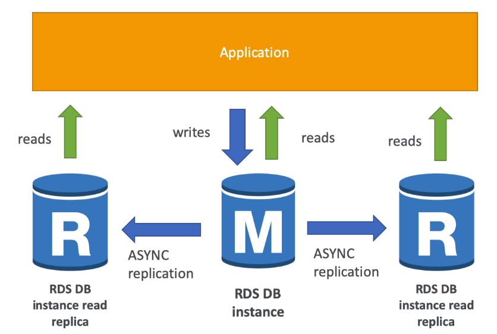

## RDS
- Relational Database Service
- Managed DB service that uses SQL as query language
- It allows you to create databses in the cloud
  - Postgres
  - MySQL
  - MariaDB
  - Oracle
  - Microsoft SQL Server
  - Aurora (Amazon's proprietary DB)

### Advtgs of RDS over deploying DB on EC2

- Managed Database Service
  - Automated Provisioning, OS patching...
  - Automated backups, so can restore to anywhere back in time
  - Provides monitoring Dashboard
  - Scaling capability (vertical and horizontal)
  - Read Replicas for improved Read performance
  - Multi-AZ deployment for Disaster Recovery
  - Maintenance Window for upgrades
  - Storage backed by EBS (gp2/io1)
- But you cant SSH in to the instance

### RDS Backups
* Backups are enabled by default in RDS
* **Automated backups**
    * Daily full backup (during maintenance window)
    * Backups of transaction logs (every 5 minutes)
    * 7 days retention (can increase upto 35)

- **DB Snapshots** are backups but that is manually triggered by the user
    - Can retain backup as long as you want

### Auto scaling
* When RDs detects you're running out of space, it scales automatically
* You have to set Maximum Storage Threshold
- You can setup to automatically scale when:
  - 10% of storage is remaining
  - Low-storage lasts at least 5 minutes
  - 6 hours have passed since last modification
* Useful for applications with unpredictable workloads
* Supports all RDS database engines

## RDS Read Replicas
* New replicated DB instances are created for reads
* **Used for scaling reads**
* You can set up to 5 Read Replicas
* There is asynchronous replication between the replica and the database
* We have cross region replication, cross AZ replication or replicaiton within the same AZ
* Read Replicas can also be set up as stand alone DBs aswell 
    * But after that no replication from main database will take place

  
* Use Case (For Read Replica): To run analytics on DB. But, running it on main database can cause the application to slow down. So read-replicas can be useful
  
* Usually there is network charges for inter-AZ communication
* But, for read-replicas, there are no extra network charges for cross AZ replication, but you need to pay network charges for Cross Region Replication7
  

## Multi-AZ 
* This type of deployment is **used for Disaster Recovery**
* Here, another database instance is created in another AZ and synchronous replication takes place
* Incase of an AZ failure, the failover takes place to the standby instance in the other AZ
* The application only talks to a single DNS endpoint, so there is no downtime
* The standby DB is only for standby, not used for scaling
* **Read Replicas also can be set-up as multi-AZ for Disaster Recovery**
  
  
* For setting up multi-AZ, we just need to click the "modify" button
* But, what internally happens is, the snapshot of the main database is taken
* And the standby databse is created in another AZ from this snapshot
* Then synchronization is established between both

### Read Replica vs Multi-AZ
* Read Replica used for scaling reads 
* Multi-AZ used for Disaster Recovery
  
* Read replica can be set-up as multi-AZ for Disaster Recovery
* But, Multi-AZ is only for standby, NOT FOR SCALING

___
> * Synchronous Replication is when the application writes simultaneously to both the databases
> * Asynchronous Replication is when the application only writes to the main database and the data is replicated from the main database

## RDS Encryption
* Encryption at rest
    * Can encrypt the master and Read replicas using KMS AES-256
    * Encryption has to be defined at launch time
    * Read-replicas cannot be encrypted if main DB cannot be encrypted
* In-flight encryption
    * Takes place using SSL Certificates
    * To enforce SSL:
        * You need to modify a parameter group in RDS Console for Postgres
        * You need to run an SQL command for MySQL
### Encrypting RDS Backups
* Snapshots of un-encrypted database is un-encrypted
* Snapshots of an encrypted database is encrypted

* Database restored from an un-encrypted snapshot is also unencrypted
To encrypted an unencrypted database
* You need to take a snapshot of the DB
* Copy the snapshot (where you'll encrypt it)
* And create a new database from the encrypted snapshot (which will be encrypted)

## RDS Security
### Network Security
* RDS databases are usually deployed in a private Subnet
* It has SGs attached to it referencing IP addresses and Security Groups from which it can receive traffic from 
### Access Management
* IAM policies help control who can manage AWS RDS (creating DBs, deletion, replication..)
* Username and password is used to login to the database
* IAM-based authentication can be used to login to RDS databases (mySQL & PostgreSQL)
### IAM Authentication
* Only works for MySQL and PostgreSQL databases
* Instead of a password, an authentication token is obtain through RDS & IAM API calls
* The auth token expires within 15 minutes
Benefits
* Network in/out must be encrypted using SSL
* IAM is used to centrally manage users instead of DB itself
> IAM authentication is probably used only for EC2 instances

  
### User's Responsibility
* Configure SGs to allow connections from only required IP and ports
* Configure parameter groups to force SSL connections
* Creating DB with/without public access (as needed)
* Managing authentication for logging into DB or using IAM authentication
### AWS Responsibility
* No manual OS patching
* No manual DB patching
* No SSH access
* No way to audit (analyze) underlying instances

## Aurora
* AWS's proprietary database. MySQL and PostgreSQL, both are supported
* Database optimized for cloud. So better performance
    * 5x more perfromance than RDS MySQL
    * 3x more performance than RDS PostgreSQL
* The storage size automatically in increments of 10GB to 128 GB
* Provides up to 15 read-replicas and only 5 for MySQL. Replication process is quick 
* 20% more cost than RDS, but more efficient
* Instantaneous failover. High Availability 
### High Availability 
* Aurora stores data in 6 copies across 3 different AZs (no matter what)
    * It needs only 4 copies out of 6 for writes 
    * It needs only 3 copies out of 6 for reads
* The master instance is used for write 
* Fast automatic failover to read replicas. Read replicas can become the new master DB incase of failover
* Supports Cross Region Replication

  
### Aurora DB Cluster
* Has writer endpoint to establish communication between client and Aurora's main Writer instance. Incase of failover, the writer endpoint automatically switches to the correct failover instance (which is a read-replica)
* Has reader endpoint for reads from clients with load-balancing feature and auto scaling feature to match workloads
* So an Aurora DB has a total of two DNS endpoints
  
> Automatic Failover, backups and auto scaling are some features of Aurora

### Aurora Security
* Same as RDS Security
* Data at rest is encrypted using KMS, in-flight encryption takes place using SSL, SSL is enforced by modifying param groups, SGs are used to protect instances, IAM authentication is available for MySQL & PostGres   

[Refer RDS Security]

## Aurora Advanced
### Custom Endpoint
* You can create custom endpoints when you have different versions of database instances running for different type of workloads
* So you create a custom endpoint for one type of workload and another endpoint for another type of workload
* The default reader endpoint does not disappear but is usually not used when you have a custom endpoint

  

### Aurora Serverless
* Automated DB instantiation, and auto-Scaling based on actual usage
* Good for unpredictable workloads
* No need to provision capacity
* Pay-per-use 

### Aurora Multi-Master
* Enabling this option will make all the nodes performing read-write operations
* Used for immediate failover for writer node (HA)
* 
> HA: High Availability
### Global Aurora
* Aurora Cross Region Read Replicas
    * Used for disaster recovery
    * Easy to set up
* Aurora Global Database
    * You set one region as the primary region and can set 5 secondary regions (only for read) with minimal replication lag
    * Each secondary region can have upto 16 read replicas
    * Incase of a region failure, you can quickly failover to DB in another region

### Aurora Machine Learning
* Aurora can integrate with machine learning services from AWS
* Supported Services:
    * Amazon SageMaker (use with any ML model)
    * Amazon Comprehend (for sentiment analysis)
* Allows you to add ML-based prediction for your applications
* No need for ML experience
* Use Cases: Fraud detection, sentimet analysis, personalized experiences, ads targetting..

  