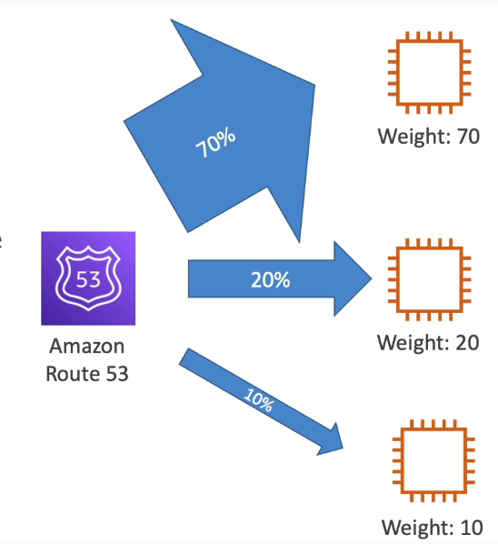

## DNS
* Domain Name System. Used to translate hostnames to machine's IP addresses
### DNS Terminologies
* Domain Registrar: Where you register your domain. Amazon Route 53, GoDaddy....
* Types of DNS Records: A, AAAA, CNAME, NS...
* Zone File: Contains all DNS Records
* Name Servers: Used to resolve DNS queries
* Top Level Domain (TLD): .com, .net, .org...
* Second Level Domain (SLD): amazon.com, google.com...

  
### How DNS Works
 
* When we search for a website, what happens internally is, our web browser talks to the local DNS server (managed by ISP) to get the address for the hostname
* If the _local DNS server_ does not have it, it talks to the _Root DNS server_ which provides us the TLD server's address
* Then, our computer talks to the _TLD DNS Server_ which provides us the address of SLD DNS Server
* So, we connect to the _SLD DNS Server_ which is managed by the Domain Registrar of the website. So, we finally get the address for the actual website we were looking for and connect to it. 
* The IP address for the hostname is then cached in our local DNS server

## Route 53
* It is a highly available, scalable, fully managed and authoritative DNS Service
    * _Authoritative_ = The customer can update the DNS Records
* It is also a Domain Registrar
* It also has the ability to check the health of the resources
* Provides 100% availability SLA 
    * SLA: Service Level Agreement  
    * _100% availability SLA_ means that Route 53 is 100% available service. If it is not available anytime, you get some credits based on the agreement
>` 53 is a reference to a traditional DNS port. So hence the name Route 53
### Route 53 - Records
* Each record determines how you want to route traffic for a domain
* A DNS Record contains the following
    * **Domain Name**
    * **Record Type**: A, AAAA, CNAME, NS
    * **IP address**: Actual address to which the traffic needs to be routed to 
    * **Routing Policy**
    * **TTL**: Time To Live; Duration until which the DNS record should be cached in the DNS Resolver

### Record Types
* **A**: An A-record maps a hostname to an IPv4 address
* **AAAA**: Maps a hostname to an IPv6 address
* **CNAME**: Maps one hostname to another hostname
    * The hostname must be an A/AAAA record
    * CNAME cannot be used for tip of the domain (zone apex)
        * Ex: CNAME cannot be used to map example.com but can be used for www.example.com
* **NS**: NameServers for the hosted zone
    * These are the servers that responds to your DNS queries for your hosted zone

### Hosted Zones
* A **Hosted Zone** is a container for Records that defines how the traffic is to routed to your domains/subdomains
* A public hosted Zone contains records that specifies how the Internet traffic is routed
* A private hosted zone contains records that specifies how the traffic within your VPC is routed

  
> You pay 0.50$/month for any hosted zone

### TTL 
* Time To Live
* TTL defines the duration until which the record will be cached in the client's computer
* So within this duration, if the web browser requests an IP for the same hostname, it is fetched from the cache, not from Route53
* High TTL 
    * Records will be outdated for that time period incase if you modify your record
    * Less costs incurred on Route53 because less requests received
* Low TTL
    * Records are updated quick incase of any change in the record
    * Can cost more if, more request for DNS queries is sent to Route53
* Excepct for _Alias_ records, TTL is mandatory for every DNS record    

### Alias Records
* Used to map a hostname to an **AWS Resource**
* Many AWS resources like ELBs, EC2 instances provide a DNS endpoint. With _ALIAS_ type of record, we can map a hostname to these DNS endpoints
  
* Can be used for the top node of a domain name (zone apex)
    * ie- can be used for a _root domain_ aswell unlike CNAME (ex: example.com and asif.example.com both are supported)
* Alias Record is always of type A/AAAA record for AWS resources
* You can't set TTL for Alias records
* An **EC2 instance DNS endpoint cannot be mapped** in an ALIAS record type 
* Other supported Alias Record targets are _ELB_, _CloudFront Distribution_, _API Gateway_, _Elastic Beanstalk Environments_, _S3 Websites_, _Global Accelerator_, _VPC Interface Endpoints_, _Route 53 Records in the same hosted Zone_

### CNAME vs ALIAS record
* **CNAME**
    * Used to map a hostname to **another hostname**
    * The hostname must be an A/AAAA record
    * Only works for a **non-root domain** (ex: asif.example.com)
* **ALIAS**
    * Used to map a hostname to an **AWS resource**
    * Can be used for both, a **root domain**(example.com) aswell as **non-root domain**(asif.example.com)
    * It has native health checks
    * ALIAS records are free of charge

## Route53 Routing Policies
* A routing policy defines how Route53 responds to a DNS query
* Simple
* Weighted
* Failover
* Latency Based
* Geolocation
* Multi-Value Answer
* GeoProximity
> Do not confuse the word 'route'. Here 'routing' means routing to the IP address for the DNS hostname
### Simple Routing Policy
* Returns a DNS record for the give hostname
* You can also specify multiple values(IP) in the same record. If multiple values are specified, one is chosen randomly by the client
* Hoever, with Aliases enabled, you can only specify one AWS resource
* This routing policy does not come with health checks 

  
### Weighted Routing Policy
* With weighted routing policy, you can control the % of requests that go to each resource
* Here, you can assign weight to multiple records and according to the weight assigned, the traffic will be sent to the resource on that record
  
* The records must have the **same hostname** and **same record type**
* Can be associated with health checks
* Use cases: load balancing between regions, testing new application versions..

  
* The weights don't have to sum up to 100
* Assign a weight of 0 to a record to stop sending traffic to a resource
• If all records have weight of 0, then all records will be returned equally
> ELB vs Route53: https://stackoverflow.com/questions/57321793/elastic-load-balancer-elb-and-route-53-in-aws

### Latency Based Routing Policy
* This policy is used to redirect users based on the least latency
* Here, we create multiple records with the same hostname but with _latency routing policy_
* So, when the users access the hostname, they are automatically redirected to the resource which will provide the lowest latency for them
* Can be associated with health checks (has failover capability)
  
> Latency is  actually based on the AWS Region. The closer the region, lower the latency :)

## Route 53 Health Checks
* HTTP based health checks for public resources
* They allow you to perform automatic DNS failover
* 3 types of healthchecks:
    * Healthchecks on a particular endpoint
    * Healthchecks that monitor other healthchecks (Calculated Healthchecks)
    * Healtchecks on CloudWatch alarms 
* These healthchecks are integrated with CloudWatch(CW) Metrics
### Health checks Monitoring Endpoint
* About 15 healthcheckers from various region perform these healthchecks
* In these healthchecks you can specify:
    * Healthy/unhealthy threshold
    * Healthchecks Interval (defaults to 30s) | 10s interval -> more cost
    * Supported Protocols: HTTP, HTTPS, TCP
    * choice of Regions for Route53 to use
* If > 18% of healthchecks pass, it is considered healthy, else unhealthy
  
* Healthchecks pass only when endpoints responds with 2xx/3xx status codes
* Healthchecks can also be set up to pass/fail based on checking the first 5120 bytes of a text-based response
* The resources must have configured firewall (SGs) to allow these Route53 healthcheckers

### Calculated Health Checks
* A master healthchecker monitors the child healthchecks
* Can check up to 256 child healthchecks
* Can specify amount of healthchecks that need to pass, to make the master healthcheck healthy

  
### Healthcheck - Private Hosted Zones
* You cannot directly use Route53 healthchecks on private resources (both on-premises/privateVPC) because Route53 healthcheckers live outside the VPC
* You need to create a cloudWatch metric and associate a CloudWatch Alarm to it
* The cloudWatch Alarm can be monitored using Route53 healthchecks and is considered unhealthy if te CloudWatch Alarm is in the _alarm_ state

## Routing Policies (..contd)
### Failover Routing Policy
  
* Here, the healthcheck is performed, and only the the record of the healthy instance is returned to the user
* there can be only one primary and one secondary record
  
* So here, we create two records with the same hostname just like previous routing policies
* In, one of the records we connect to a primary resource and a secondary resource in other one
* The primary record must be associated with a healthcheck, so that when the instance/resource in the primary record is unhealthy, it failovers to the instanc in the secondary record

### Geolocation Routing Policy
* Route users based on their location
* You can specify a continent, a country or a US state 
* Must create a "default" record, if the location does not match
* Can be associated with health checks
> Different from latency policy. In latency based policy, the record in the region close to the user is chosen but here the user is routed to the endpoint only if they belong to a particular location, else routed to the endpoint in the "default" record

### GeoProximity Routing Policy
* In this type of routing policy, you can shift more traffic to specific resource(s)
* Here, you need to specify a _bias_ value
* According to the bias value the traffic is redirected to the resource
    * A resource in a region with a higher bias will attract more traffic
  
* A resource can be:
    * An AWS Resource (need to specify AWS Region)
    * Non-AWS Resource (need to specify Latitude and Longitude) | (On-premises erver -> Non-AWS Resource)
* You must use _Route53 Traffic Flow_ to use this feature

  
  
  
  

### Route53 Traffic Flow
* A Visual Editor for creating and managing more complex routing decision trees 
* Simplified process of creating and managing records in large and complex configurations 
* Configurations can be saved as _Traffic Flow Policy_
    * Can be applied to different Route53 hosted zones (ie- different domain names)
    * Supports versioning
> Multiple Policies can be probably chained in a _traffic flow policy_

### Multi-Value Routing Policy
* Used when routing traffic to multiple resources
* Returns multiple records for the clients to choose from 
* Has healthchecks associated with it. So, only healthy records are returned
* Up to 8 records can be returned for each _Multi-Value_ query
* It is different from specifying multiple records in _Simple Routing Policy_ because, Simple Routing Policy does not have health checks associated with it, so it might return an unhealthy record, which is not the case in _Multi-value Routing Policy_
> While creating records for multiple resources using this policy, you don't specify multiple values in one record rather you need to create multiple records each referring to one resource

## Domain Registrar vs DNS Service
* Domain Registrars like GoDaddy also come with DNS Service. But you can choose to use a DNS Service of your choice aswell. In our case - Amazon Route53
* To use a 3rd party domain name:
    * You create a Hosted Zone in Route53 first
    * Then, you go to the domain registrar's website and set the nameservers of your domain = nameservers in your hostedZone
        * So, this way when a DNS query happens for your domain name, your domain registrar will provide the NameServers for your DNS Service which will contain all the DNS records for your domain
    