## CIDR
* Classless Inter-domain Routing. A method for allocating IP addresses
* It helps to define an IP address range
  
A CIDR consists of two components:
* **Base IP**
    * Represents an IP contained in that range (XX.XX.XX.XX)
    * Usually, its the first IP in that range
    * Ex: 10.0.0.0, 192.168.0.0 ...
* **Subnet Mask**
    * This defines how many bits can change in the IP
    * Ex: /0, /24, /32
    * It can have two forms:   
        * /32 OR 255.255.255.255
        * /24 OR 255.255.255.0
        * /16 OR 255.255.0.0
        * /8 OR 255.0.0.0 

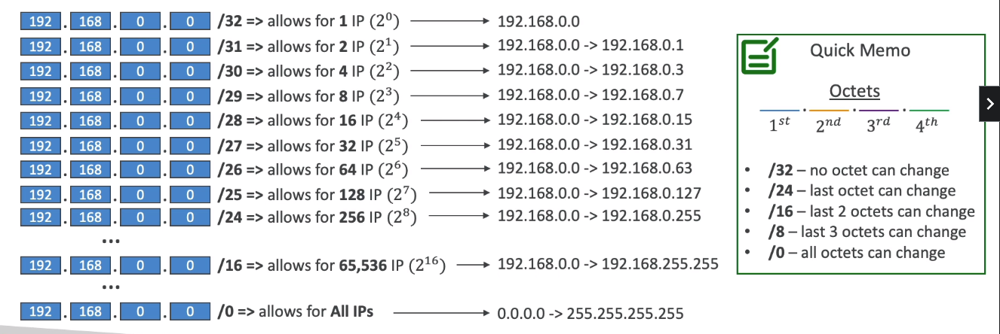  
* Subnet mask basically tells you how many IPs and what IPs can you get from the Base IP

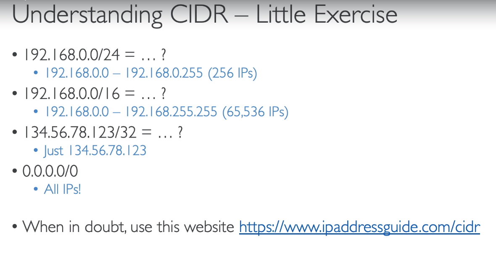  
### Public vs Private IPv4s
* Internet Assigned Numbers Authority (IANA) have set of IP addresses of Private IPs and Public IPs
* Private IPs cann allows only certain values:
    * 10.0.0.0/8 (10.0.0.0 - 10.255.255.255) -> In big networks
    * 172.16.0.0/12 (172.16.0.0 - 172.31.255.255) -> AWS Default VPC is in that range
    * 192.168.0.0/16 (192.168.0.0 - 192.168.255.255) -> ex: In home networks
* Rest all are public IPs

## Default VPC
* All new AWS accounts will have a default VPC
* The EC2 instances by default are launched in the default VPC
* The instances launched have internet connectivity by default and have Public IPv4 addresses
* We also get a public IPv4 and private IPv4 DNS names
* Network Traffic through NACL (incoming AND outgoing) is allowed (by default) in the Default VPC

## VPC
* **Virtual Private Cloud**
* Amazon VPC enables you to build a virtual network in the AWS cloud - no VPNs, hardware, or physical datacenters required. You can define your own network space, and control how your network and the Amazon EC2 resources inside your network are exposed to the Internet.
* You can create maximum of 5 VPCs in one AWS Region (soft limit)
* Each VPC can have 5 CIDRs. For each CIDR,
    * min range is /28 (16 addresses)
    * max range is /16 (65536 addresses)
* Because VPC is private, you can only use private IP CIDRs mentioned earlier (10.0.0.0/8, 172.16.0.0/12, 192.168.0.0/16)
* The VPC CIDR must not overlap with your other networks (ex: your corporate network)

## Subnet
* Subnet is a sub-range of IPv4 addresses in your VPC
* It can be a public subnet or a private subnet
* AWS Reserves 5 IP addresses **in each subnet** (not in VPC)
    * The first 4 addresses and the last address is reserved. Therefore, these addresses cannot be used and cannot be assigned to an EC2 instance
* Ex: If 10.0.0.0/24 is the CIDR block for a subnet, then reserved IP addresses are
    * 10.0.0.0 - Network Address
    * 10.0.0.1 - reserved by AWS for VPC Router
    * 10.0.0.2 - reserved by AWS for mapping to Amazon-provided DNS
    * 10.0.0.3 - reserved by AWS for future use
    * 10.0.0.255 - Network Broadcast Address. Even though AWS does not support broadcast in a VPC, address is reserved

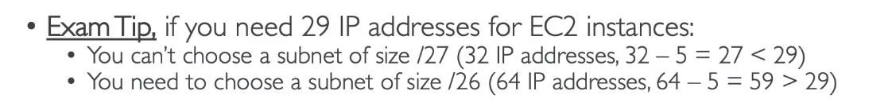  
> Subnets that have access to the internet are **public subnet** and subnets that don't have internet access are called **private subnet**
### HandsON
* You choose a smaller IP range for a public subnet 
* Within a VPC, the CIDR range assigned to subnets cannot overlap

## Internet Gateway (IGW)
* Used to provide internet access to resources (EC2 instances) in the VPC
* It scales horizontally and is highly available
* Must be created seperately and then attached to a VPC
* One VPC can have only one IGW attached to it and vice versa
* IGW on their own does not allow internet access, the RouteTables for the Subnet must be modified

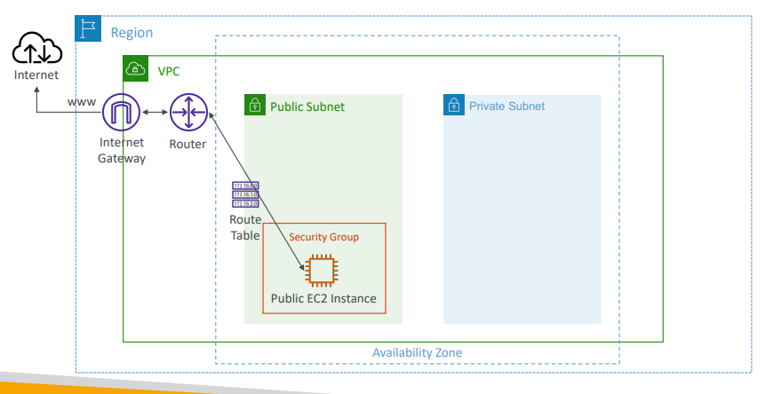  
### HandsON
* You need to modify the subnet settings to allow, auto-assigning IPv4 to resources (EC2 instances) created in the subnet
* SGs in one VPC cannot be used in another
* You need your EC2 instance to be connected to the internet for you to be able to SSH into the instance
    * Because your comouter is on a different network, the instance is on a different network.
    * You can SSH into the instance (without internet connection) if you're on the same network 
    * But since your PC is on a different network, not the VPC, you need internet connection 
* The routing rules in the routing table apply to the associated subnets
    * Ex: IGW Routing applies to the subnets associated (hence, public subnetsx)

## Bastion Hosts
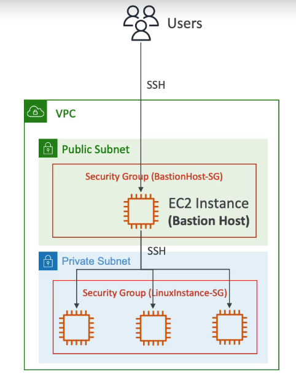  
* Bastion hosts are EC2 instances in public subnets 
* We use a bastion host to SSH into EC2 instances in private subnets
* Bastion Host SG **must be tightened** because having access to bastion host means you have access to all your private EC2 instances
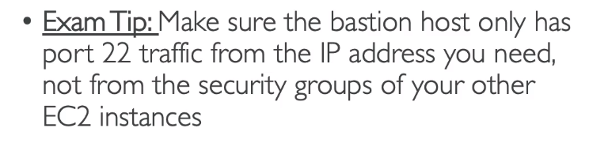  
### HandsON
* You need to allow SSH from bastion host, in the security group rule of the private EC2 instance

## NAT Instances
* Network Address Translation
* NAT instances are created in the public subnet (with dedicated NAT AMIs)
* When private instances (instances in private subnet) need to access the internet, they connect via NAT instances
* NAT instances must have elasticIP attached to it
* Route Tables must be configured to route traffic from private subnets to the NAT instance

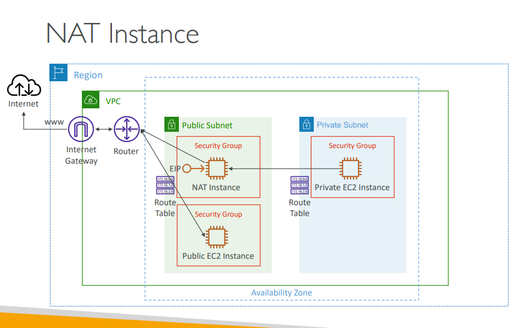  
* EC2 Source/Destination check must be disabled in the EC2 network settings as, NAT instances rewrite the network packets with their own Source and Destination
### Cons
* Standard Support for NAT AMIs ended along with 2020 ;)
* Not highly available / resilient 
* Internet bandwidth depends on instance type
* SGs must be managed by you
### HandsON
* If your private instance is trying to access the internet through NAT instance, then you must allow HTTP in your nat-instance-sg with source as the CIDR in which your private instance exists
* For the `ping` command to work on your private instance, you must enable ICMP protocol in your nat instance sg

## NAT Gateway 
* AWS-managed NAT, highly available, higher bandwidth, no administration
* Pay per hour for usage and bandwidth
* NATGW is created in a specific AZ and uses Elastic IP
* Instances in the same subnet cannot use the NAT gateway
* Requires an IGW to work (private subnet => NAT Gateway => IGW)
* 5 Gbps of bandwidth with automatic scaling upto 45 gbps
* Don't need to manage SGs

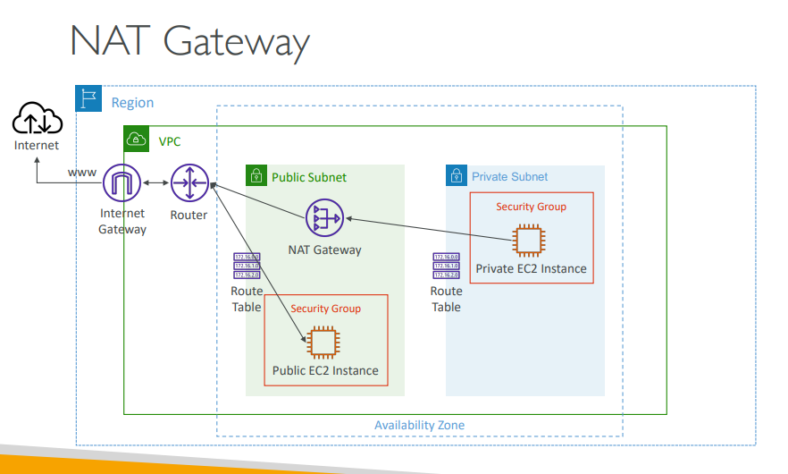  
### NATGW with High Availability
* NATGW is resilient within a single AZ
* Can create multiple NATGWs in multiple AZs for fault tolerance
* No need for cross-AZ failover because if the AZ goes down, the instances within the subnet in the same AZ also go down

### NAT instance vs NATGW
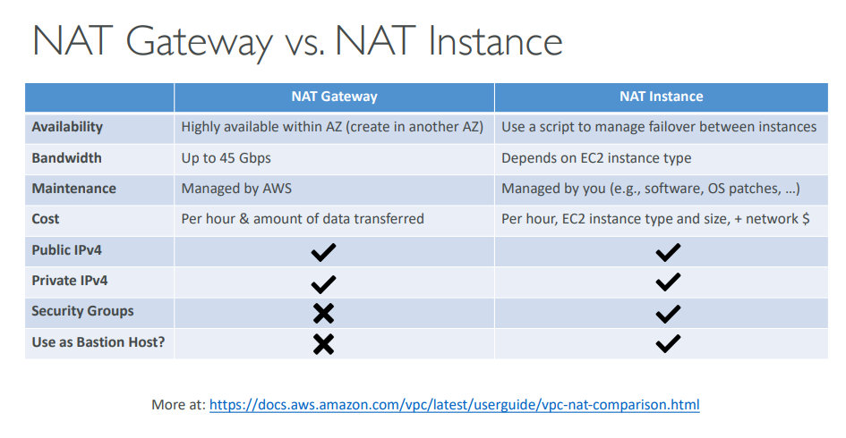  

## DNS Resolution
> Both of these are attributes VPC attributes (not instance attributes)
### enableDNSsupport (DNS Resolutions)
* This attribute it set to _true_ by default.
* This attribute specifies if Route 53's DNS resolver is supported for your VPC
* If it is set to _true_, then EC2 instance within your VPC will be able to query the Amazon Provider's DNS Service at **169.254.169.253** or the **reserved IP address**
* If you don't have this enabled, you won't be able to use Route53's DNS resolver and  need to have your own DNS server
> Reserved IP address is what we saw in the [subnet](#subnet) (10.0.0.2) 

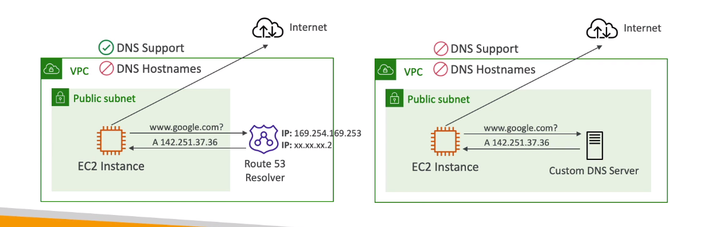  
### enableDNShostnames
* This is set to _true_ for Default VPC and _false_ for custom VPCs by default
* It assigns public hostnames for EC2 instances if it has a public IPv4
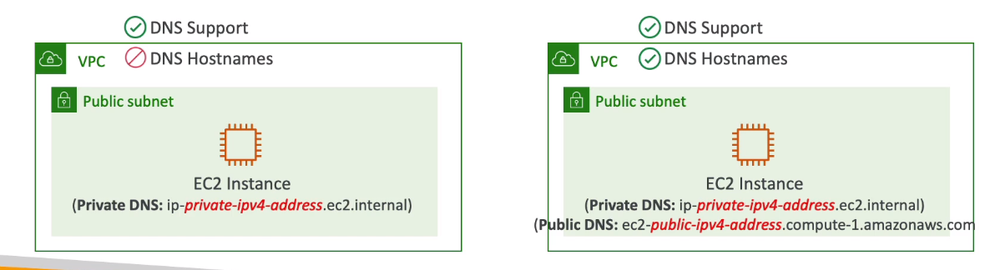  

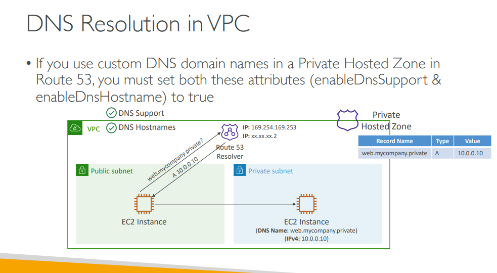

## NACL
* Network Access Control List
* NACLs are like firewalls at subnet level. Controls traffic to and from subnets
* A subnet can have only one NACL. But one NACL can have multiple subnets associated with it
* Newly created subnets are assigned to **Default NACL** 
* You define NACL Rules
    * Rules have a number (1-32766). Higher Precedence = Lower the number
    * First rule match will decide the traffic flow
    * Example: If you define `#100 ALLOW 10.0.0.10/32` and `#200 DENY 10.0.0.0/32`, the IP address will be allowed because 100 has a higher precedence than 200
    * The last rules is an asterik(*) and denies the request incase of no rule match
    * AWS recommends to create rules in increment of 100s
* Newly created NACLs will deny everything by default and **Default NACLs allows everything (both inbound/outbound) by default**
* NACLs are a great usecase for blocking an IP address at subnet level
### Stateless vs Stateful
* NACLs are stateless whereas SGs are stateful
    * **Security groups are stateful**. For example, if you send a request from an instance the outbound rules are evaluated and then the request is sent if it aligns with the outbund rules. The **response traffic** for that request is allowed to reach the instance regardless of the inbound security group rules. and vice versa (stateful)
    * **NACLS are stateless**. It means that **responses** to allowed outbound traffic are subject to the rules for inbound traffic (and vice versa) unlike SGs.
    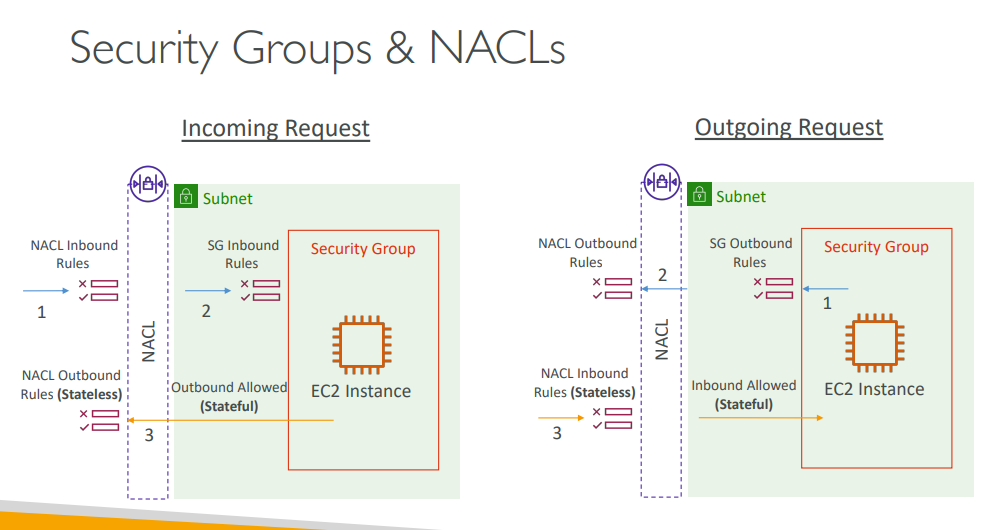  
### Ephemeral Ports
* For any two endpoints to establish a connection, they must use ports
* The endpoint that is establishing a connection will open a port that will only last until the connection lasts. This port is called an **ephermal port**
* So clients connects to a _defined port_ and expects a respones in the _ephermal port_
* Different OSs use different port ranges 
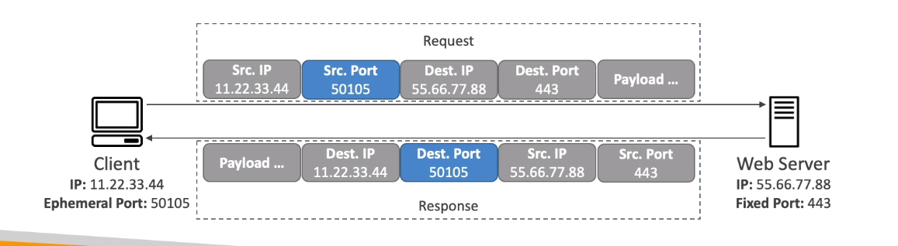  
### NACL with Ephemeral Ports
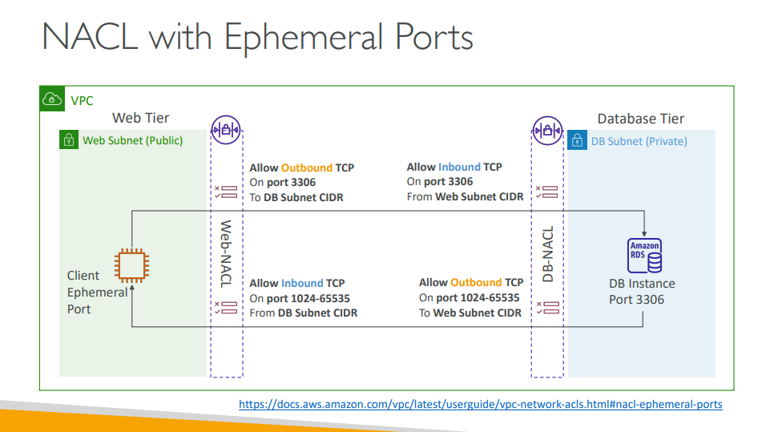  
* You must define NACL rules to allow requests from/to ephemeral ports
### NACLs with multiple subnets
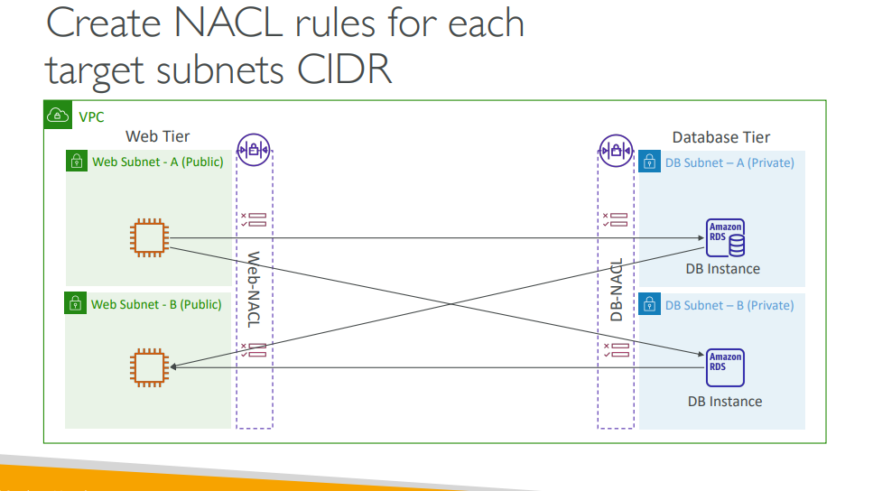  
* If you have multiple subnets attached to a NACL, you need to define NACL rules for each combination as every subnet has a specific CIDR range
### SG vs NACL
  

## VPC - Reachability Analyzer
* Network Diagonostics tool that allows you to ensure connectivity between two different endpoints
* It does not send packets, but builds a model from the network configurations and checks if two endpoints are reachable
* IF it is reachable, it displays all the hops between the endpoints
* IF it is not reachable, it displays the components that block the connectivity (Ex: configuration issues in SGs, NACLs, Route Tables..)
* Use Cases: Used to troubleshoot network connectivity issues, ensure network configuration is as intended..