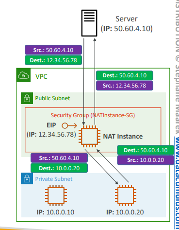
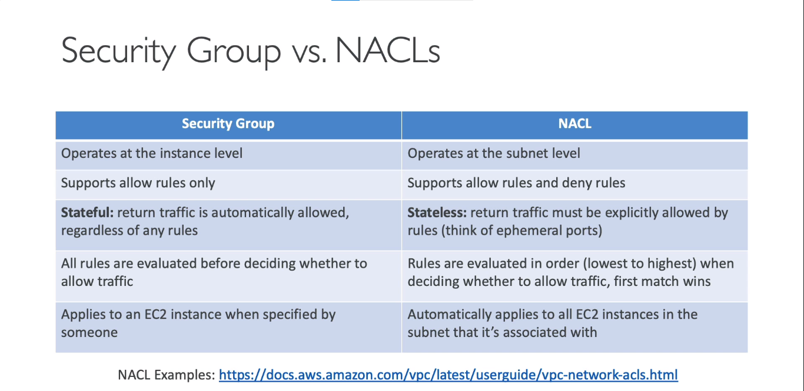

## CIDR
* Classless Inter-domain Routing. A method for allocating IP addresses
* It helps to define an IP address range
<br></br>
A CIDR consists of two components:
* **Base IP**
    * Represents an IP contained in that range (XX.XX.XX.XX)
    * Usually, its the first IP in that range
    * Ex: 10.0.0.0, 192.168.0.0 ...
* **Subnet Mask**
    * This defines how many bits can change in the IP
    * Ex: /0, /24, /32
    * It can have two forms:   
        * /32 OR 255.255.255.255
        * /24 OR 255.255.255.0
        * /16 OR 255.255.0.0
        * /8 OR 255.0.0.0 

  
* Subnet mask basically tells you how many IPs and what IPs can you get from the Base IP

  
### Public vs Private IPv4s
* Internet Assigned Numbers Authority (IANA) have set of IP addresses of Private IPs and Public IPs
* Private IPs cann allows only certain values:
    * 10.0.0.0/8 (10.0.0.0 - 10.255.255.255) -> In big networks
    * 172.16.0.0/12 (172.16.0.0 - 172.31.255.255) -> AWS Default VPC is in that range
    * 192.168.0.0/16 (192.168.0.0 - 192.168.255.255) -> ex: In home networks
* Rest all are public IPs

## Default VPC
* All new AWS accounts will have a default VPC
* The EC2 instances by default are launched in the default VPC
* The instances launched have internet connectivity by default and have Public IPv4 addresses
* We also get a public IPv4 and private IPv4 DNS names
* Network Traffic through NACL (incoming AND outgoing) is allowed (by default) in the Default VPC

## VPC
* **Virtual Private Cloud**
* Amazon VPC enables you to build a virtual network in the AWS cloud - no VPNs, hardware, or physical datacenters required. You can define your own network space, and control how your network and the Amazon EC2 resources inside your network are exposed to the Internet.
* You can create maximum of 5 VPCs in one AWS Region (soft limit)
* Each VPC can have 5 CIDRs. For each CIDR,
    * min range is /28 (16 addresses)
    * max range is /16 (65536 addresses)
* Because VPC is private, you can only use private IP CIDRs mentioned earlier (10.0.0.0/8, 172.16.0.0/12, 192.168.0.0/16)
* The VPC CIDR must not overlap with your other networks (ex: your corporate network)

## Subnet
* Subnet is a sub-range of IPv4 addresses in your VPC
* It can be a public subnet or a private subnet
* AWS Reserves 5 IP addresses **in each subnet** (not in VPC)
    * The first 4 addresses and the last address is reserved. Therefore, these addresses cannot be used and cannot be assigned to an EC2 instance
* Ex: If 10.0.0.0/24 is the CIDR block for a subnet, then reserved IP addresses are
    * 10.0.0.0 - Network Address
    * 10.0.0.1 - reserved by AWS for VPC Router
    * 10.0.0.2 - reserved by AWS for mapping to Amazon-provided DNS
    * 10.0.0.3 - reserved by AWS for future use
    * 10.0.0.255 - Network Broadcast Address. Even though AWS does not support broadcast in a VPC, address is reserved

  
> Subnets that have access to the internet are **public subnet** and subnets that don't have internet access are called **private subnet**
### HandsON
* You choose a smaller IP range for a public subnet 
* Within a VPC, the CIDR range assigned to subnets cannot overlap

## Internet Gateway (IGW)
* Used to provide internet access to resources (EC2 instances) in the VPC
* It scales horizontally and is highly available
* Must be created seperately and then attached to a VPC
* One VPC can have only one IGW attached to it and vice versa
* IGW on their own does not allow internet access, the RouteTables for the Subnet must be modified

  
### HandsON
* You need to modify the subnet settings to allow, auto-assigning IPv4 to resources (EC2 instances) created in the subnet
* SGs in one VPC cannot be used in another
* You need your EC2 instance to be connected to the internet for you to be able to SSH into the instance
    * Because your comouter is on a different network, the instance is on a different network.
    * You can SSH into the instance (without internet connection) if you're on the same network 
    * But since your PC is on a different network, not the VPC, you need internet connection 
* The routing rules in the routing table apply to the associated subnets
    * Ex: IGW Routing applies to the subnets associated (hence, public subnetsx)

## Bastion Hosts
  
* Bastion hosts are EC2 instances in public subnets 
* We use a bastion host to SSH into EC2 instances in private subnets
* Bastion Host SG **must be tightened** because having access to bastion host means you have access to all your private EC2 instances
  
### HandsON
* You need to allow SSH from bastion host, in the security group rule of the private EC2 instance

## NAT Instances
* Network Address Translation
* NAT instances are created in the public subnet (with dedicated NAT AMIs)
* When private instances (instances in private subnet) need to access the internet, they connect via NAT instances
* NAT instances must have elasticIP attached to it
* Route Tables must be configured to route traffic from private subnets to the NAT instance

   
* EC2 Source/Destination check must be disabled in the EC2 network settings as, NAT instances rewrite the network packets with their own Source and Destination

 
### Cons
* Standard Support for NAT AMIs ended along with 2020 ;)
* Not highly available / resilient 
* Internet bandwidth depends on instance type
* SGs must be managed by you
### HandsON
* If your private instance is trying to access the internet through NAT instance, then you must allow HTTP in your nat-instance-sg with source as the CIDR in which your private instance exists
* For the `ping` command to work on your private instance, you must enable ICMP protocol in your nat instance sg

## NAT Gateway 
* AWS-managed NAT, highly available, higher bandwidth, no administration
* Pay per hour for usage and bandwidth
* NATGW is created in a **specific AZ** and uses Elastic IP
* Instances in the same subnet cannot use the NAT gateway
* Requires an IGW to work (private subnet => NAT Gateway => IGW)
    * NAT gateway is created in a public subnet
* 5 Gbps of bandwidth with automatic scaling upto 45 gbps
* Don't need to manage SGs
> NAT instances and NAT gateway (is supposed to) prevent inbound traffic
  
### NATGW with High Availability
* NATGW is resilient within a single AZ
* Can create multiple NATGWs in multiple AZs for fault tolerance
* No need for cross-AZ failover because if the AZ goes down, the instances within the subnet in the same AZ also go down

### NAT instance vs NATGW
  

## DNS Resolution
> Both of these are attributes VPC attributes (not instance attributes)
### enableDNSsupport (DNS Resolutions)
* This attribute it set to _true_ by default.
* This attribute specifies if Route 53's DNS resolver is supported for your VPC
* If it is set to _true_, then EC2 instance within your VPC will be able to query the Amazon Provider's DNS Service at **169.254.169.253** or the **reserved IP address**
* If you don't have this enabled, you won't be able to use Route53's DNS resolver and  need to have your own DNS server
> Reserved IP address (for DNS) is what we saw in the [subnet](#subnet) (10.0.0.2) 

  
### enableDNShostnames
* This is set to _true_ for Default VPC and _false_ for custom VPCs by default
* It assigns public hostnames for EC2 instances if it has a public IPv4
  


## NACL
* Network Access Control List
* NACLs are like firewalls at subnet level. Controls traffic to and from subnets
* A subnet can have only one NACL. But one NACL can have multiple subnets associated with it
* Newly created subnets are assigned to **Default NACL** 
* You define NACL Rules
    * Rules have a number (1-32766). Higher Precedence = Lower the number
    * First rule match will decide the traffic flow
    * Example: If you define `#100 ALLOW 10.0.0.10/32` and `#200 DENY 10.0.0.0/32`, the IP address will be allowed because 100 has a higher precedence than 200
    * The last rules is an asterik(*) and denies the request incase of no rule match
    * AWS recommends to create rules in increment of 100s
* Newly created NACLs will deny everything by default and **Default NACLs allows everything (both inbound/outbound) by default**
* NACLs are a great usecase for blocking an IP address at subnet level
### Stateless vs Stateful
* NACLs are stateless whereas SGs are stateful
    * **Security groups are stateful**. For example, if you send a request from an instance the outbound rules (of the SG) are evaluated and then the request is sent if it aligns with the outbound rules. The **response traffic** for that request is allowed to reach the instance regardless of the inbound security group rules. and vice versa (stateful)
    * **NACLS are stateless**. It means that **responses** to allowed outbound traffic are subject to the rules for inbound traffic (and vice versa) unlike SGs.
      
### Ephemeral Ports
* For any two endpoints to establish a connection, they must use ports
* The endpoint that is establishing a connection will open a port that will only last until the connection lasts. This port is called an **ephemeral port**
* So clients connects to a _defined port_ and expects a respones in the _ephermal port_
* Different OSs use different port ranges 
  
### NACL with Ephemeral Ports
  
* You must define NACL rules to allow requests from/to ephemeral ports
### NACLs with multiple subnets
  
* If you have multiple subnets attached to a NACL, you need to define NACL rules for each combination as every subnet has a specific CIDR range
### SG vs NACL
  

## VPC - Reachability Analyzer
* Network Diagonostics tool that allows you to ensure connectivity between two different endpoints
* It does not send packets, but builds a model from the network configurations and checks if two endpoints are reachable
* IF it is reachable, it displays all the hops between the endpoints
* IF it is not reachable, it displays the components that block the connectivity (Ex: configuration issues in SGs, NACLs, Route Tables..)
* Use Cases: Used to troubleshoot network connectivity issues, ensure network configuration is as intended..

  

## VPC Peering
* Used to privately connect two VPCs using AWS's network
* Make them behave as if they were in the same network
* The VPC CIDRs must not overlap
* VPC Peering is not transitive
* You must update Route Tables in each VPC's subnets to ensure EC2 instances can communicate with each other
  
<br></br>
* You can create VPC peering connection across VPCs from different AWS accounts/Regions
* You can reference a SG from a peered VPC (works cross account - same region)
  

## VPC Endpoints
* VPC Endpoints allow you to connect EC2 instances (in your VPC) privately to AWS Services rather than using the public network
    * Using public network means: (public subnet => IGW => AWS Service) OR (private subnet => NATGW => IGW => AWS Service)
      
* VPC endpoints allow your private instances to connect to the AWS services without having internet access
> VPC Endpoints are powered by AWS PrivateLink
  
* VPC Endpoints are redundant and scale horizontally
* They remove the need of IGW, NATGW.. to access AWS Services
* In case of issues:
    * Check DNS Resolution Settings in your VPC
    * Check Route Tables
### Types of Endpoints
* Interface Endpoint
    * Provisions an ENI (which comes with private IP address) and sets it as an entry point for accessing AWS Services
    * Must attach a Security Group to the ENI
    * Supports most AWS services
    *    
* Gateway Endpoint 
    * Provisions a gateway that must be set as the target in the route table
    * Only supports S3 and DynamoDB
    *   
 ### HandsON
 * You need to create an IAM role for the instance in your VPC to access AWS Services
 * You associate the private subnet when you create an endpoint

## VPC Flow Logs
* Captures information about IP traffic going through your interfaces
    * VPC Flow Logs
    * Subnet Flow Logs
    * ENI Flow Logs
* Helps to monitor and troubleshoot connectivity issues
* Logs can be pushed to S3 / Cloudwatch Logs
* Captures network information on AWS managed interfaces too: ELB, RDS, ElastiCache, RedShift, Workspaces, NATGW, Transit Gateway
* VPC Flow Logs can be qeueried using Athena on S3 OR Cloudwatch Logs Insights

### VPC Flow Logs Syntax
  
* **srcaddr & destnaddr** - help identify problematic IP
* **srcport & destport** - help identify problematic ports
* **Action** - success or failure of the request due to SG/NACL
* Can be used for analytics on usage patterns or malicious behaviour
#### ACTION in VPC Flow Logs
* For Incoming Requests
    * If it is an inbound REJECT, then it must be a SG/NACL issue
    * If it is an inbound ACCEPT and outbound REJECT, then it is a NACL issue
* For Outgoing Requests,
    * outbound REJECT => SG/NACL issue
    * outbound ACCEPT, inbound REJECT => NACL issue
  

## AWS Site-to-Site VPN (S2S)
   
* It is for establishing a private connection between your VPC and your corporate data center that goes over the public network
* For, this to happen, you need 2 things, **Virtual Private Gateway** and **Customer Gateway**
### Virtual Private Gateway (VGW)
* VGW is set up on the AWS side to establish the VPN connection
* It is created and attached to the VPC from which you want to create the S2S VPN connection
* Ability to customize ASN (Autonomous System Number)
### Customer Gateway (VGW)
* This may be a software application or a physical device that is set up on the customer side
* If the CGW is public, it should have a public IP, we use that public IP for establishing S2S VPN connection
* If the CGW is private, it would be behind a NAT device (that has NAT-Traversal \[NAT-T] enabled), so we use the public IP of the NAT instance
  
> * Need to enable **Route Propogation** in the route table for VGW for S2S VPN connection to work 
> * You need to allow ICMP protocol in the inbound rules of your SG if you wanna ping your EC2 instances from on-premises
### AWS VPN CloudHub
  
* Provides secure communication **between multiple sites**, if you have multiple VPN connections
* Low cost hub-and-spoke model (VPN-only)
* It's a VPN connection, so it goes over the public internet
* To set it up, establish multiple VPN connections on same VGW, setup dynamic routing and configure route tables
> VPN connections are encrypted

## Direct Connect (DX)
> DC - Data Centre; DX - Direct Connect; VIF - Virtual Network Interface
* Provides a dedicated **private** connection between a remote network and your VPC
* For this to happen, you must set up a dedicated connection from your datacentre to AWS Direct Connect Locations. This takes more than 1 month to set up
```
VPC <-> Direct Connect Location <-> Your Data Centre
```
* You also need to set up a VGW on your VPC to establish connection between your on-premises DC and AWS
* Acess public resources (S3) and private (EC2) on same connection (using public/private VIF)
* Supports both IPv4 and IPv6
* Use cases:
    * Increased bandwidth; Working with large data sets can cost less
    * More consistent networking experience; applications using real-time datafeed
    * Hybrid Environments (on prem + cloud)

  
* On-premises data centre accesses the private resources (in the private subnet) through a virtual network interface (VIF) connecting to the VGW
* Similarly, it can access public services like S3 through public virtual interface directly, without connecting to the VGW
### Direct Connect Gateway 
    
  
* This gateway is used if you want to set up _Direct Connect_ to multiple VPCs in different regions (same-account) 

### DX Connection Types
* **Dedicated Connections**: 1 Gbps and 10 Gbps capacity
    * Physical ethernet port dedicated to a customer 
    * Request made to AWS first, and then fullfilled by AWS Direct Connect partnerd
* **Hosted Connections**: 50 Mbps, 500 Mbps, ... to 10Gbps
    * Capacity can be added/removed **on-demand**
    * Connection requests are made via AWS Direct Connect Partners
> These connections are between your network (DC) and one of the AWS Direct Connect locations
> Physical ethernet port is available for dedicated connections in the AWS DX Location
### DX Encryption
  
* The data in transit between the data centre and the AWS Direct Connect location goes over the public network and is not encrypted
* You can establish an S2S VPN connection between the DC and DX location which provides an IPsec-encrypted private connection | (Direct Connect + VPN)
* Slightly complex to set up
> DC: Data Centre
### DC Resiliency
  
* High Resiliency can be obtained by connecting to multiple data centres. So if one DX Location goes down, other datacentre connected to different DX location will be still available
* Maximum Resiliency can be obtained by establishing multiple connections to the same DX Location. And to maximize, multiple connections to multiple DX Locations

## AWS PrivateLink
You can expose services in your VPC to other VPC in generally two ways:
* Through the internet
    * But, here you use the public network (www)
    * Tough to manage access
* By VPC Peering
    * By Enabling VPC Peering, you're allowing other VPCs to communicate with each other as if they are on the same network
    * But, with this you're exposing your whole network instead of just one service
    * Must create many peering relations
  

* So, the solution is to use **AWS PrivateLink** (or VPC Endpoint Services) 
    * Most Secure & Scalable way to expose a service to 1000s of VPCs (same/other account)
    * Does not rquire VPC Peering, IGW, NATGW, route tables, ...
* You can expose your service through a **Gateway Load Balancer** (OR) a **Network Load Balancer** and an **ENI**
    * NLB on the VPC that's exposing the service AnD ENI on the VPC that's using the service

  
  
## EC2-Classic & AWS ClassicLink
> Deprecated Service and likely to be a distractor
* **EC2-Classic**: Instances run in a single network shared with other customers
* This is how initially AWS was started. Later they brought the concept of VPC
* AWS introduced _AWS ClassicLink_ to link _EC2-Classic_ instances with a VPC 
    * Communication happens using private IPv4 addresses
## Transit Gateway (TGW)
* Transit Gateway allows transitive connection between multiple VPCs and on-premises
* Works with Direct Connect Gateways, VPN connections aswell..
* Regional Resource, can work cross-region
* Can peer across Transitive Gateways across Regions
* Share TGW cross-account using Resource Access Manager (RAM)
* Create Route Tables to control which VPC an talk with which VPC
* Supports **IP Multicast** 
    * **Transit Gateway** is the only service that supports IP Multicast 

  
### TGW: S2S VPN ECMP
* Another usecase for a TGW is to create multiple S2S VPN connections to increase the bandwidth  of your connection to AWS (with ECMP)
* ECMP => Equal Cost Multi Path Routing
    * Routing strategy to allow to forward a packet over multiple best path

  
* Usually when establishing an S2S connection with the VGW, two tunnels are present and both the tunnels are used in one connection
* But, when having a VPN connection with TGW, both the tunnels are used simultaneously to increase bandwidth, and multiple S2S connections are established to maximize bandwidth
  

### TGW: Share DX bewteen multiple accounts
* You can use TGW if you need to set up a Direct Connect between multiple accounts
  

## VPC - Traffic Mirroring
* Mirrors Traffic received on VPC (from ENIs) and routes to security appliances to perform content inspection, threat monitoring, troubleshooting..
* It allows you to capture and inspect network traffic in your VPC
* Captures traffic FROM (ENIs) and routes it TO (ENI or NLB)
* Can capture all packets, or only packets of your choice
* Source and Target must be in the same VPC (or different VPCs if VPC Peering)

  
> VPC Traffic Mirroring is at ENI level whereas VPC Flow Logs is at VPC Level

## IPv6
* We'll soon run out of IPv4 addresses; IPv6 is the successor of IPv4
* IPv6 provides 3.4 * 10^38 unique IP addresses
* Every IPv6 is public and internet-routable (no private range)
* IPv6 Format - X:X:X:X:X:X:X:X 
    * X -> hexadecimal number (from 0000 to ffff)
* Ex: 2001:db8:3333:4444:5555:6666:7777:8888 
### IPv6  in VPC
* **IPv4 cannot be disabled for your VPC and subnets**
* You can enable IPv6 to operate in dual-stack mode
    * Dual-stack means every EC2 instance will get atleast a private internal IPv4 and a public IPv6
    * They can communicate using either IPv4/IPv4 to the internet through the IGW
### IPv6 troubleshooting
* If ever your instance is not able to launch in a subney, it is not because you've run out of IPv6 addresses, but you might have run out of private IPv4 addresses
* So, the solution is to create another IPv4 CIDR Range for your subnet 

## Egress Only Internet Gateway
* Used for **IPv6 ONLY**
* It is basically a _NAT gateway for IPv6_
* It allows **only outbound traffic** for instances in your VPC over IPv6
* You must update the route tables

  
  

## Networking Costs in AWS
  
  
  
  