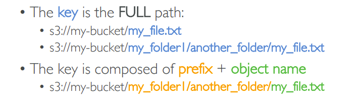
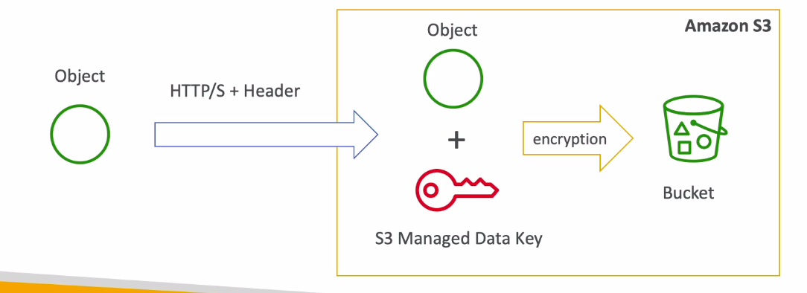
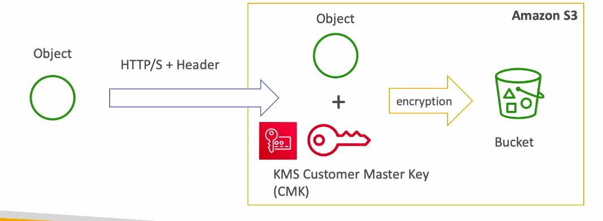
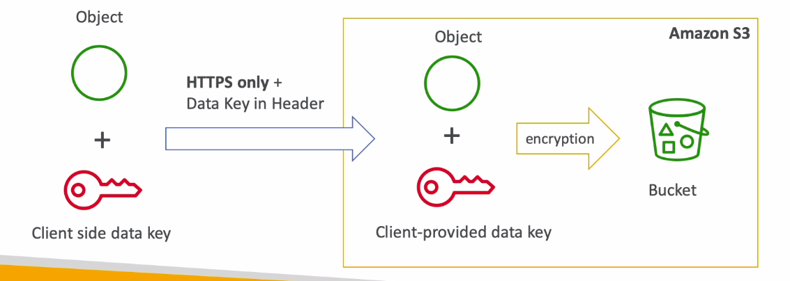
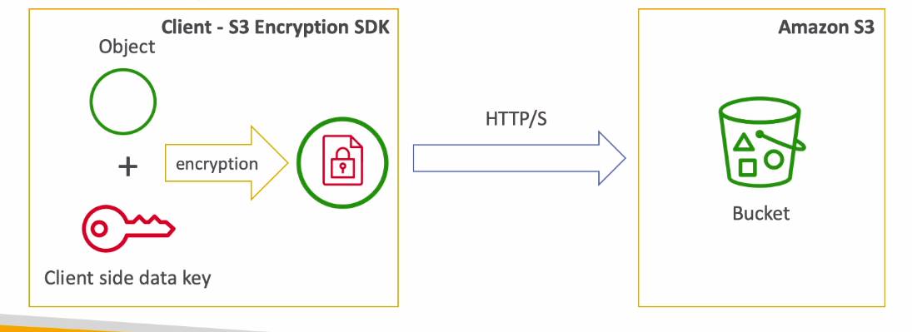
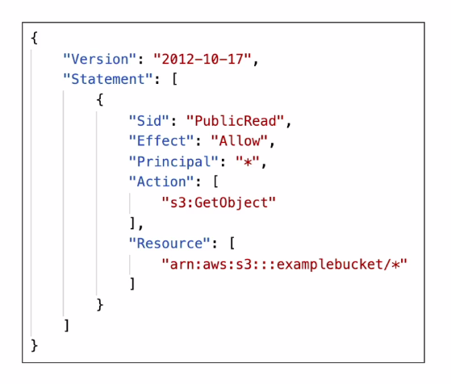
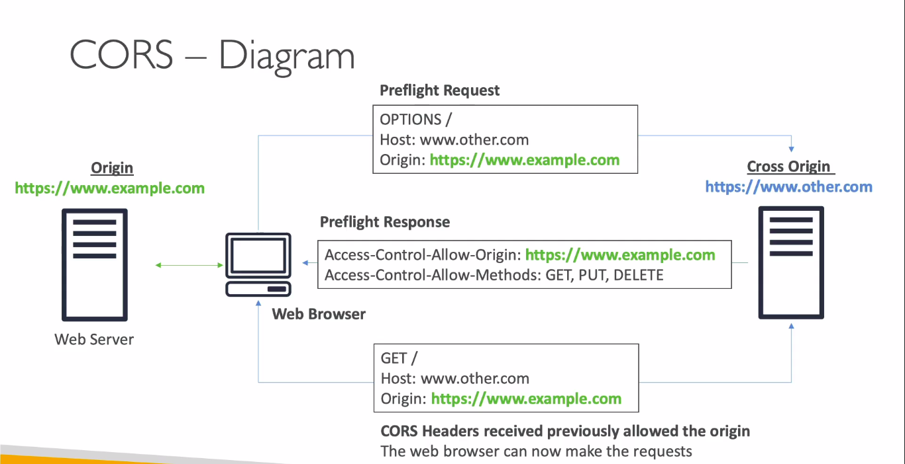

## S3 Buckets
* Buckets are created at regional level
* The name of the bucket must be **globally** unique (not just within your account)
* Naming convention for the bucket:
    * No uppercase & No underscore
    * 3-63 characters long 
    * Should not be an IP
    * Must start with a letter or a number
 

* Objects (files) have keys
    * Keys are just path of the file
    * Keys consist of prefix and Object name
 
* One object can be a maximum of 5TB size
* Objects larger than 5GB are uploaded using multi-part upload 
* Objects can have: Metadata, Tags and Version Id (If bucket versioning is enabled)
> Objects -> Files; Buckets -> Parent directory

## S3 - Versioning
* Amazon S3 allows you to version your files. It is enabled at the **bucket level**
* If the file with the same key (ie- file in the same path) is uploaded again, new version of the file is created
* It is considered best practice to use versioning
    * Allows to recover from unintended deletion of objects
    * Easy to rollback to previous versions
Note:
* Any file that is not versioned prior to enabling versioning will have version "null"
* If versioning is disabled, the previous versions are not deleted
 
* Deleting an object while having versioning enabled, does not actually delete the object but creates a delete marker (with a versionID)
* Deleting the delete marker will restore to the previous version of the object

## S3 Encryption
Amazon S3 offers 4 type of encryption: SSE-S3, SSE-KMS, SSE-C, CSE
> SSE - Server Side Encryption
> CSE - Client Side Encryption
### SSE-S3
* Encryption keys are fully managed by Amazon S3
* Uses AES-256 type of encryption (algorithm)
* Must set header "x-amz-server-side-encryption":"AES256"

### SSE-KMS
* Leverages Key Management Service (KMS) to store and manage keys
    * KMS Advtgs: user control + audit trail; full control over the rotation policy of the encryption key;
* Must set header "x-amz-server-side-encryption":"aws:kms"

### SSE-C
* Encryption keys are fully managed by the customer
* Amazon S3 does not store the encryption key you provide. So you once again need to privide the encryption key when you retrieve the object (for decryption to happebd)
* Must use HTTPS endpoint 
* Encryption key must be provided in HTTP headers, for every HTTP request made

> SSE-C can be done only through the CLI as the ecnryption key needs to be passed
### CSE
* Customer manages both, the keys and the encryption cycle
* When the object is retrieved, the customer must decrypt the object
* Client Library such as Amazon S3 Encryption client can help for CSE

### Encryption in Transit
* Amazon S3 exposes:
    * HTTP endpoint: non encrypted
    * HTTPS endpoint: encryption in flight

* You're free to use the endpoint you want, but HTTPS is recommended
* Most clients would use HTTPS endpoint by default  
* HTTPS is mandatory for SSE-C
* Encyption in flight is also called SSL/TLS

## S3 Security
* User based
    * IAM Policies: mentions which API calls should be allowed for a specific user from IAM console
* Resource Based
    * Bucket Policies - Allows cross account
    * Object Access Control List (ACL)
    * Bucket Access Control List (ACL) - less common 
* An IAM Principal can access an  S3 object only if:
    * The IAM Policy allows the user OR The Resource Policy allows it
    * **AND There is no explicit DENY** 

### S3 Bucket Policies
* JSON Policies

* S3 Bucket Policies can be used to:
    * Grant Public Access to the bucket
    * Force objects to be encrypted at upload
    * Grant Access to another account (Cross Account)

### 'Block Public Access' setting
* Blocks public access to buckets and objects granted through
    * new access control list (ACLs)
    * any access control list (ACLs)
    * new public bucket or access point policies
* These settings were created to prevent company data leaks
* Can be enabled at account level

### S3 Security - Other
#### Networking
* Supports VPC Endpoints (for instances in VPC without internet)
#### Logging and Audit
* S3 Access Logs can be stored in another S3 bucket
* API calls can be logged in CloudTrail
### User Security
* MFA Delete: MFA can be a requirement in versioned buckets to delete objects
* Pre-Signed URLs: URLs that are valid only for a limited time

## S3 Websites
* S3 allows us to host static websites on the www
* The website URL will be:
    * \<bucket-name>.s3-website-<aws-region>.amazonaws.com
    OR
    * \<bucket-name>.s3-website.<aws-region>.amazonaws.com
* If you get a 403 Forbidden Error, make sure bucket policy allows public reads
 
* To make objects public in a bucket, you need to :
    * Disable 'block public access', AND
    * Create a bucket policy that allows public access

## S3 CORS
* Cross Origin Resource Sharing
* An origin is a scheme(protocol), host(domain) and port
    * Ex: `https://example.com` 
    * protocol - https
    * domain - example.com
    * Port 443 for HTTPS
* Same origins: `http://example.com/app1` & `http://example.com/app2`
* Different Origins: `http://example.com/` & `http://mynotes.com/`

 

* CORS is a web browser based mechanism to allow request to other origins while visiting main origin
* The requests won't be fulfilled unless the other origin allows for the requests using CORS Headers (ex: Access-Control-Allow-Origin)

### S3 CORS
* If a client needs to do a cross-origin request on our S3 bucket, we need to enable the correct CORS headers
* You can allow for a specific origin or for all origins (*)

## Amazon S3 Consistency Model
* As of December 2020, S3 has been strongly consistent
* Consistent, meaning that a read request after an updation/creation of the object will **immediately** reflect changes
* Available at no additional cost, without any performance impact