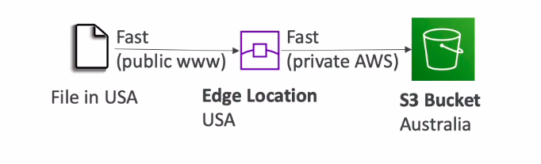

# S3 Introduction

## S3 Buckets
* Buckets are created at regional level
* The name of the bucket must be **globally** unique (not just within your account)
* Naming convention for the bucket:
    * No uppercase & No underscore
    * 3-63 characters long 
    * Should not be an IP
    * Must start with a letter or a number
 

* Objects (files) have keys
    * Keys are just path of the file
    * Keys consist of prefix and Object name
 
* One object can be a maximum of 5TB size
* Objects larger than 5GB are uploaded using multi-part upload 
* Objects can have: Metadata, Tags and Version Id (If bucket versioning is enabled)
> Objects -> Files; Buckets -> Parent directory

## S3 - Versioning
* Amazon S3 allows you to version your files. It is enabled at the **bucket level**
* If the file with the same key (ie- file in the same path) is uploaded again, new version of the file is created
* It is considered best practice to use versioning
    * Allows to recover from unintended deletion of objects
    * Easy to rollback to previous versions
Note:
* Any file that is not versioned prior to enabling versioning will have version "null"
* If versioning is disabled, the previous versions are not deleted
 
* Deleting an object while having versioning enabled, does not actually delete the object but creates a delete marker (with a versionID)
* Deleting the delete marker will restore to the previous version of the object

## S3 Encryption
Amazon S3 offers 4 type of encryption: SSE-S3, SSE-KMS, SSE-C, CSE
> SSE - Server Side Encryption
> CSE - Client Side Encryption
### SSE-S3
* Encryption keys are fully managed by Amazon S3
* Uses AES-256 type of encryption (algorithm)
* Must set header "x-amz-server-side-encryption":"AES256"

### SSE-KMS
* Leverages Key Management Service (KMS) to store and manage keys
    * KMS Advtgs: user control + audit trail; full control over the rotation policy of the encryption key;
* Must set header "x-amz-server-side-encryption":"aws:kms"

### SSE-C
* Encryption keys are fully managed by the customer
* Amazon S3 does not store the encryption key you provide. So you once again need to privide the encryption key when you retrieve the object (for decryption to happebd)
* Must use HTTPS endpoint 
* Encryption key must be provided in HTTP headers, for every HTTP request made

> SSE-C can be done only through the CLI as the ecnryption key needs to be passed
### CSE
* Customer manages both, the keys and the encryption cycle
* When the object is retrieved, the customer must decrypt the object
* Client Library such as Amazon S3 Encryption client can help for CSE

### Encryption in Transit
* Amazon S3 exposes:
    * HTTP endpoint: non encrypted
    * HTTPS endpoint: encryption in flight

* You're free to use the endpoint you want, but HTTPS is recommended
* Most clients would use HTTPS endpoint by default  
* HTTPS is mandatory for SSE-C
* Encyption in flight is also called SSL/TLS

### Default Encryption vs Bucket Policy
* There is an option to enable default encryption in the bucket setting
* Another way to force encryption of objects is with the bucket policy
* However, the bucket policy is first evaluated before default encryption

## S3 Security
* User based
    * IAM Policies: mentions which API calls should be allowed for a specific user from IAM console
* Resource Based
    * Bucket Policies - Allows cross account
    * Object Access Control List (ACL)
    * Bucket Access Control List (ACL) - less common 
* An IAM Principal can access an  S3 object only if:
    * The IAM Policy allows the user OR The Resource Policy allows it
    * **AND There is no explicit DENY** 

### S3 Bucket Policies
* JSON Policies

* S3 Bucket Policies can be used to:
    * Grant Public Access to the bucket
    * Force objects to be encrypted at upload
    * Grant Access to another account (Cross Account)

### 'Block Public Access' setting
* Blocks public access to buckets and objects granted through
    * new access control list (ACLs)
    * any access control list (ACLs)
    * new public bucket or access point policies
* These settings were created to prevent company data leaks
* Can be enabled at account level

### S3 Security - Other
#### Networking
* Supports VPC Endpoints (for instances in VPC without internet)
#### Logging and Audit
* S3 Access Logs can be stored in another S3 bucket
* API calls can be logged in CloudTrail
### User Security
* MFA Delete: MFA can be a requirement in versioned buckets to delete objects
* Pre-Signed URLs: URLs that are valid only for a limited time

## S3 Websites
* S3 allows us to host static websites on the www
* The website URL will be:
    * \<bucket-name>.s3-website-<aws-region>.amazonaws.com
    OR
    * \<bucket-name>.s3-website.<aws-region>.amazonaws.com
* If you get a 403 Forbidden Error, make sure bucket policy allows public reads
 
* To make objects public in a bucket, you need to :
    * Disable 'block public access', AND
    * Create a bucket policy that allows public access

## S3 CORS
* Cross Origin Resource Sharing
* An origin is a scheme(protocol), host(domain) and port
    * Ex: `https://example.com` 
    * protocol - https
    * domain - example.com
    * Port 443 for HTTPS
* Same origins: `http://example.com/app1` & `http://example.com/app2`
* Different Origins: `http://example.com/` & `http://mynotes.com/`

 

* CORS is a web browser based mechanism to allow request to other origins while visiting main origin
* The requests won't be fulfilled unless the other origin allows for the requests using CORS Headers (ex: Access-Control-Allow-Origin)

### S3 CORS
* If a client needs to do a cross-origin request on our S3 bucket, we need to enable the correct CORS headers
* You can allow for a specific origin or for all origins (*)

## Amazon S3 Consistency Model
* As of December 2020, S3 has been strongly consistent
* Consistent, meaning that a read request after an updation/creation of the object will **immediately** reflect changes
* Available at no additional cost, without any performance impact

# S3 Advanced & Athena

## MFA Delete

* MFA forces user to generate a code on their device before doing important operations on S3
* MFA-Delete can be used only if bucket versioning is enabled
* You need MFA to perform to:
    * Suspend Versioning
    * Permenantly delete an object version
* You don't need MFA for:
    * Enabling Versioning
    * Listing deleted versions

* Only the root user can enable/disable MFA-Delete
* MFA-Delete currently can be set up only using the CLI

## S3 Access Logs
* You may want to log all access to your S3 buckets for audit purposes
* Any request made to your S3 bucket, from any account, **authorized or rejected** is logged into another S3 buckets of yours
* This data can be analyzed usign data analysis tools or Amazon Athena

### Acess Logs: Dumb Mistakes
* Never set your logging bucket to be your monitored bucket, because it will create an infinite logging loop and your bucket size will grow exponentially

## S3 Replication
* CRR: Cross Region Replication
* SRR: Same Region Replication
* **Must enable versioning in both source and destination accounts** 
* Replication is asynchronous
* Buckets can be in different accounts
* Must give proper IAM permissions to S3
 
* CRR is used for lower latency access, compliance, replication across accounts
* SRR is used for log aggregation, live replication between prod and test accounts
 

* After enabling replication, only the new objects are replicated
* To replicate existing objects, _S3 Batch Replication_ can be used
    * Replicates existing objects and objects that failed replication
* Replicated objects have the same versionID

* For DELETE operations, 
    * Can replicate delete markers (optional setting)
    * Deletions are not replicated, only delete markers can be replicated (to avoid malicious deletes)

* There is no "chaining" of replication
    * If bucket1 has replication into bucket2, which has replication into bucket3, the objects created in bucket1 are not replicated in bucket3

## S3 pre-signed URLs
* Pre-signed URLs can be generated using SDK or CLI
    * For downloads (use CLI)
    * For uploads (use SDK)
* These URLs are valid for a default of 3600s. Can change the duration using `--expires-in` argument
* Users given the pre-signed URL inherit the permission of the user who generated the URL for GET / PUT
* Examples:
    * Only allow logged in users to download a premium video on your S3 bucket
    * Allow an ever changing list of users to download files by generating URLs dynamically
    * Allow temporarily a user to upload a file to a precise location in our bucket
    
## S3 Storage Classes
* Various storage classes are Amazon S3 Standard, Standard Infrequent Access (IA), One-Zone IA, Glacier Instant Retrieval, Glacier Flexible Retieval, Glacier Deep Archive, Intelligent Tiering
* Can move between these storage classes manually or using _S3 Lifecycle Configurations_

### S3 Durability and Availability
* Durability
    * If you store 10M objects with Amazon S3, you can on average expect a loss of one object every 10,000 years
    * S3 has high durability (99.999999999%, 11 9's) of objects across multiple AZ
    * It is the same for all storage classes
* Availability
    * Measure how readily a service is available
    * Varies depending on storage classes

### S3 Standard - General Purpose
* For frequently accessed data
* Low latency & High Throughput
* Sustain 2 concurrent facility failures
* Use cases: Big data analytics, mobile and gaming applications, content distribution...

### S3 Infrequent Access (IA)
* For less frequently accessed data but instant retrieval
* Lower cost than S3 standard
* Cost on retrieval
* We have _Standard IA_ and _One Zone IA_
    * In _One Zone IA_, we have high durability in a single AZ; data is lost when AZ is destroyed
    * Use cases for _Standard IA_: Disaster Recovery, Backups
    * Use cases for _One Zone IA_: Storing secondary backup copies of on-premises data, or data you can recreate

### Amazon S3 Glacier
* archive / backup data; low-cost object storage
* Pricing: price for storage + object retrieval cost

* Amazon S3 Glacier Instant Retrieval 
    * Millisecond retrieval, great for data accessed once a quarter
    * Minimum storage duration of 90 days
* Amazon S3 Glacier Flexible Retrieval
    * Expedited (1-5 minutes); Standard (3-5 hrs); Bulk (5 - 12 hrs) - free
    * Minimum storage duration of 90 days
* Amazon S3 Glacier Deep Archive - for long term storage 
    * Standard (12 hrs); Bulk (48 hrs)
    * Minimum storage duration of 180 days

### S3 Intelligent Tiering
* Small monthly monitoring and auto-tiering fee
* Moves objects automatically between tiers based on usage
* There are no retrieval charges in S3 Intelligent Tiering
Tiers:
* Frequent Access Tier (automatic): default tier
* Infrequent Access Tier (automatic): objects not accessed for 30 days
* Archive Instant Access Tier (automatic): objects not accessed for 90 days
* Archive Access Tier (optional): configurable from 90 days to 700+ days
* Deep Archive Access Tier (optional): configurable from 180 days to 700+ days

> Minimum Storage Duration implies that the object is billed for a minimum of that duration, even if you delete it before that

## S3 Lifecycle Rules
* Lifecycle Rules are set up to automate moving of objects between storage classes

> Note that, objects cannot be moved to storage classes above it. It can only be moved top to bottom

### Lifecycle Rules
* Transition Action: Defines when to transition objects between storage classes. For example,
    * Move objects to Standard IA after 60 days after creation
    * Move to Glacier for archiving after 6 months
* Expiration Action: Action that is used to expire (delete) objects after certain duration. For example,
    * Can be used to delete log files after 365 days
    * Can be used to delete old version of objects (if versioning is enabled)
    * Can be used to delete incomplete multi-part uploads
* Rules can be created for specific prefixes you want (ex: s3://mybucket/mp3/*)
* Rules can be created for specific object tags (ex: Department: Accounts)

## S3 Analytics - Storage Class Analysis
* You can enable S3 Analytics to help determine when to transition objects from Standard to Standard_IA
* Does not work for OneZoneIA or Glacier. Only for Standard to Standard_IA

* Report is updated daily 
* Takes about 24h to 48h for first start

* Can be used first before defining lifecycle rules to get a better idea for when to transition between storage classes

## S3 Performance

### S3 Baseline Performance
* Amazon S3 automatically scales to high request rates, latency 100-200 ms
* Your application can achieve atleast 3,500 PUT/COPY/POST/DELETE requests and 5,500 GET/HEAD requests **per second per prefix** in a bucket
* There are no limits to prefixes in a bucket
* Example: (object path => prefix)
    * mybucket/img/png/1 => /img/png/
    * mybucket/img/jpg/2 => /img/jpg/

* If you spread _reads_ across these 2 prefixes evenly, you can achieve 10,000 requests per second for GET and HEAD

### S3 - KMS Limitation
* If you use SSE-KMS, you may be limited with the performance of KMS
    * KMS quota per second: 5500, 10000, 30000 req/s based on region
* You can request a quota increase using the Service Quota Console
> When you upload an object (SSE-KMS), _GenerateDataKey_ KMS API is called, and _Decrypt_ KMS API when you try to download an object

### S3 Upload Performance
* **Multi-Part Upload**
    * **_recommended_** for files > 100 MB
    * **_MUST_** for files > 5GB
    * Can help parallelix uploads and speed up transfers

* **S3 Transfer Acceleration**
    * Transfers file to nearest edge location to leverage AWS's private network for faster transfer speeds
    * Compatible with multi-part upload
    * Used for both, upload and download

### S3 Download Performance
* **S3 Byte-Range Fetches**
    * Parallelize GETs by requesting specific byte ranges (Sped up Downloads)
    * Better resilience incase of failures

* Byte-range fetch can also be used **only** to retrieve partial data. For example, the head of a file which may contain some metadata about the file

## S3 Select & Glacier Select
* Retrieve less data using SQL by performing **server side filtering**
* Can filter by rows and columns 
* Less network transfer, less CPU cost client side

## S3 Event Notifications
* You can react to Events happening in S3. You can send these events to SQS, SNS or Lambda Functions to send notifications or perform any action
* Example of S3 Events => S3:ObjectCreated, S3:ObjectRestore, S3:ObjectRemoved, S3:Replication ...
* Object name filtering possible (Ex: *.jpg)
* Use Case: When an image is uploaded to S3, thumbnails should be created
 
* Can create as many S3 events as desired
* S3 event notifications typically deliver events in seconds but sometimes can take a minute or longer

### S3 Event Notifications with Amazon EventBridge

* On integrating S3 Event Notifications with Amazon EventBridge, all the events are sent to Amazon EventBridge
* **Advanced Filtering options** with JSON rules (metadata, object size, name .. )
* **Multiple Destinations** - You can send events to 18 AWS Services as destinations like Step Functions, Kinesis Stream/Firehose
* **EventBridge Capabilities** - Archive, Replay Events, Reliable delivery

## S3 Requester Pays
* Generally, it is the owner of the bucket who pays for the bucket storage, and the data transfer OUT of the bucket
* With **Requester pays buckets**, the requester instead df the bucket owner pays for the data transfer OUT of the bucket
* The requester must be authenticated with AWS (not anonymous)
* Helpful when you wanna share large datasets with other AWS accounts

## Amazon Athena
* **Serverless** query services that uses SQL to perform analytics against **S3 Objects**
* Supports CSV, JSON, ORC, Avro and Parquet
* Pricing: $5.00 per TB scanned
* Use compressed/columnar-data for cost-savings (less scan)
* Use cases: BI / analytics; analyze & query VPC flow logs, ELB Logs, CLoudTrail trails ...
> Athena is built on _Presto_ engine

## Glacier Vault Lock
* Adopts a WORM model (Write Once Read Many) model
* Objects under lock cannot be deleted
* Lock the policy for future edits (can no longer be changed)
* Helpful for compliance and data retention

## S3 Object Lock
* Adopts WORM model
* Locks the deletion of an object version for a specified amount of time (versioning must be enabled)
* Object Retention:
    * **Retention Period**: specifies a fixed time period
    * **Legal Hold**: same protection, no expiry date
* Modes:
    * Governance Mode: users can't overwrite or delete an object version or alter its lock setting unless you have special permissions
    * Compliance Mode: You cannot overwrite or delete an object version, no matter what (even if you're the root account). It's retention period also cannot be modified

    