# EC2
>  **Refer EC2 @ CCP level aswell**
## Elastic IP

- Private IPs are accessible only inside the private network
---
- **Elastic IP** is used, when you need a fixed IP for your instance as Publc IPs keep changing when you _reboot_ or stop an instance
- _Elastic IP_ is billed when it is not associated with an instance
- The address remains the same even after _restarting_ the instance, does not change like public Ipv4
- You can attach it to only one instance at a time

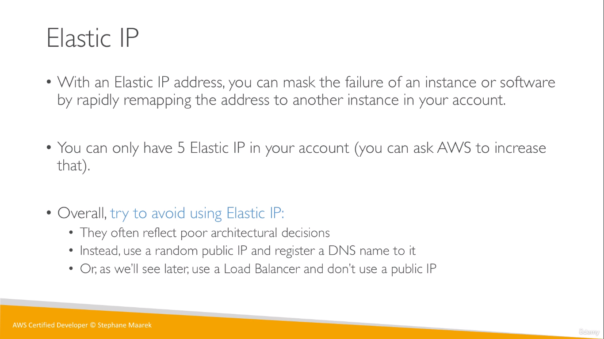  

## Placement Groups
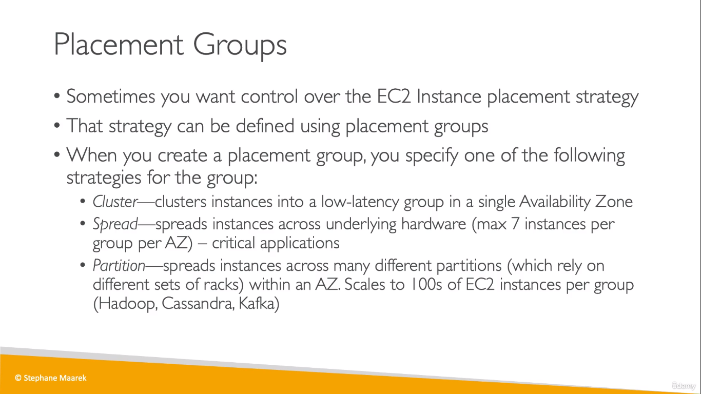  
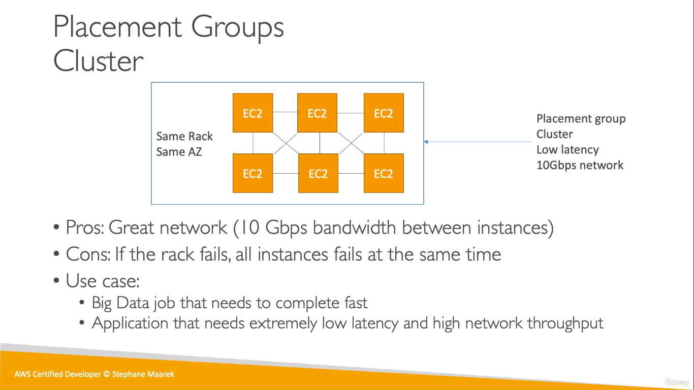  
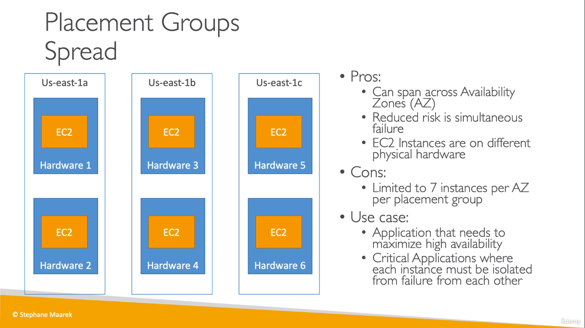  
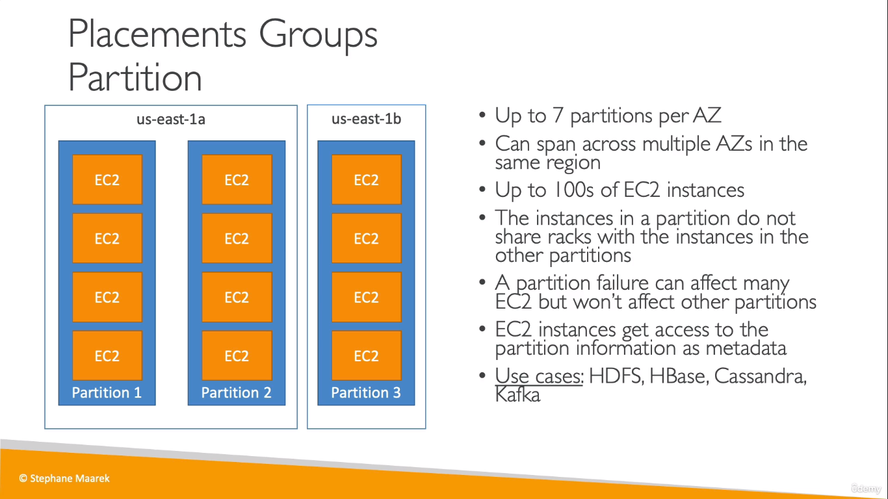  
* A maximum of 7 partitions can be chosen 

## Elastic Network Interfaces (ENI)
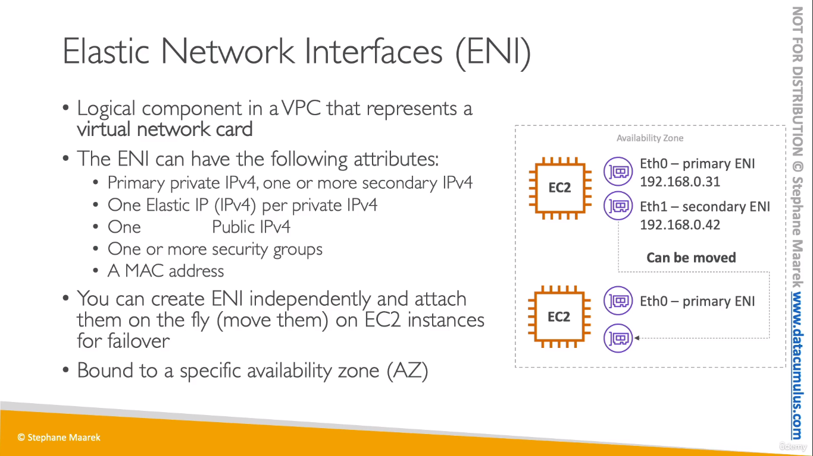  
* Read more [here](https://aws.amazon.com/blogs/aws/new-elastic-network-interfaces-in-the-virtual-private-cloud/).

## EC2 Hibernate
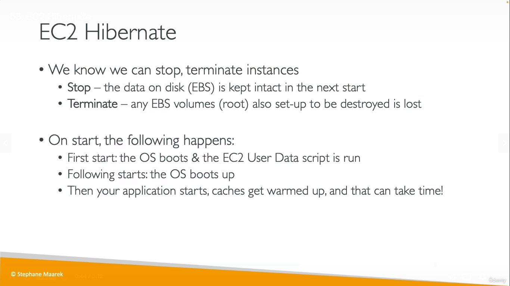
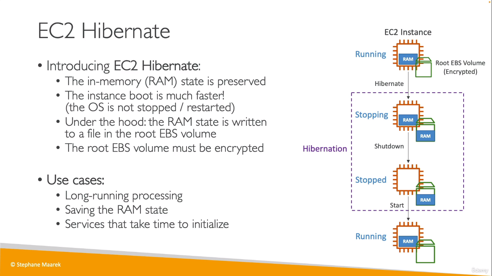  
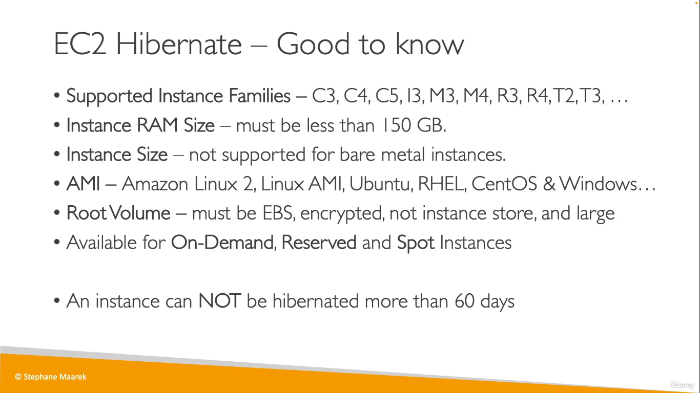  

## EC2 Nitro
* New virtualization technology

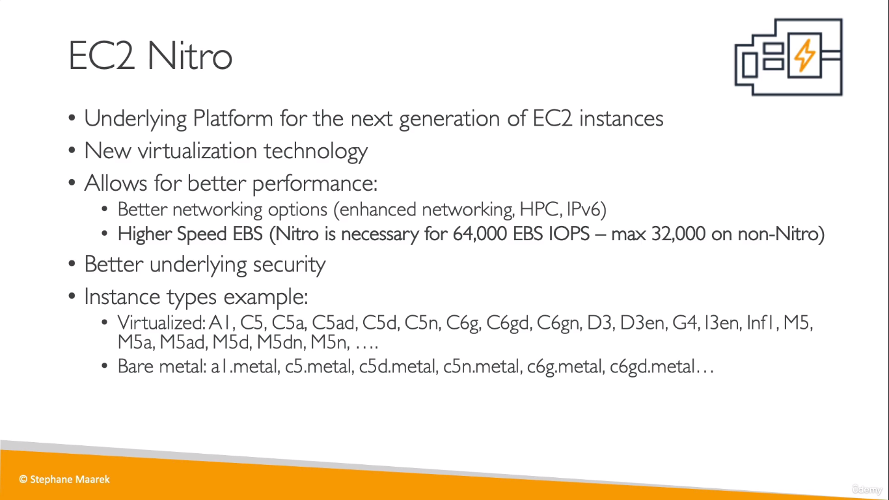  

## vCPU
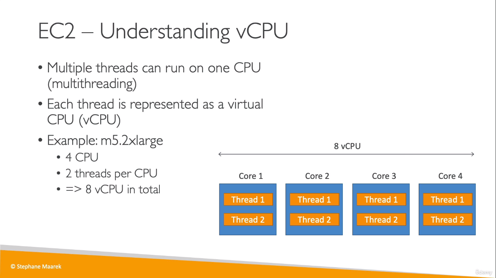  
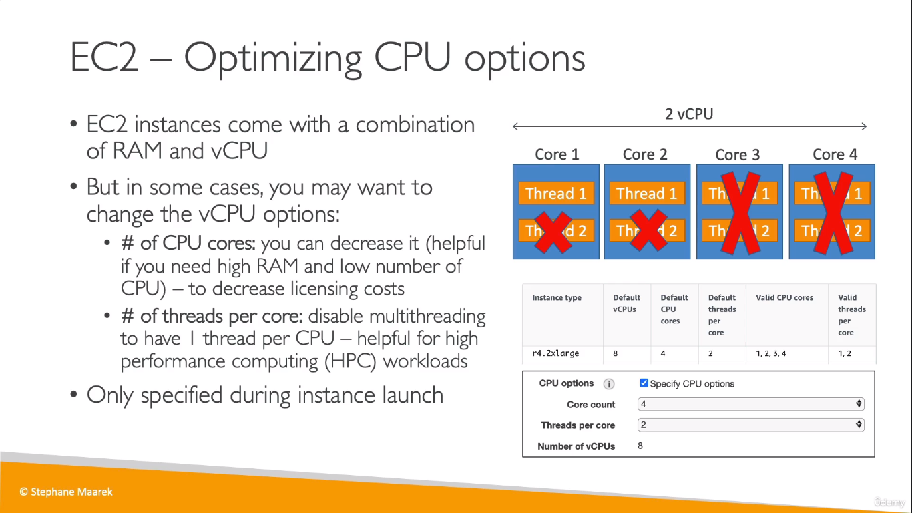  

## Capacity Reservations

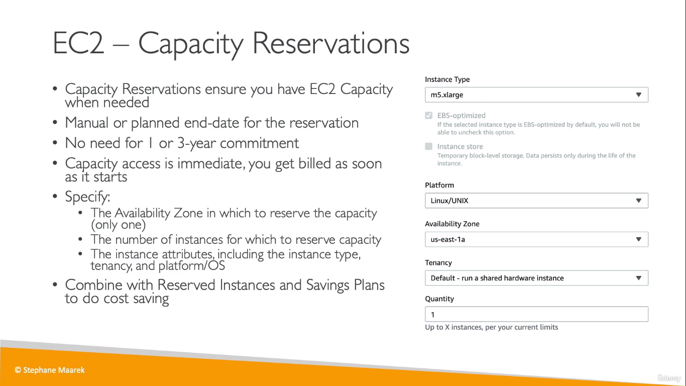  