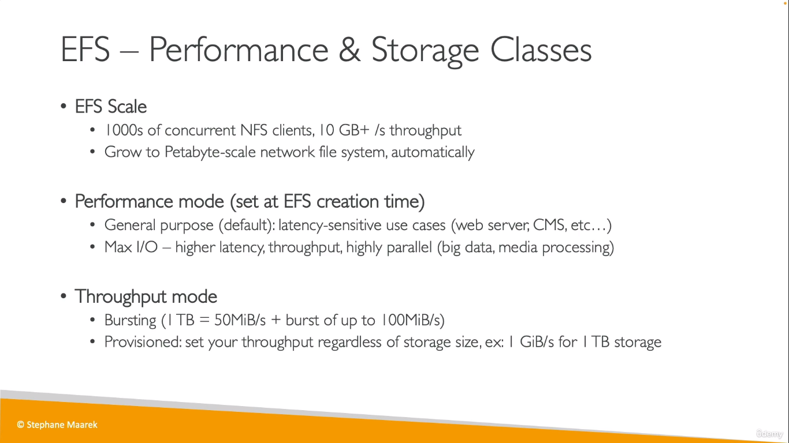

# EC2 Storage
> Refer EBS, EBS Snapshots, AMI, EC2 Instance Store from CCP

## EBS Volume Types
  
   
  
  

## EBS Multi Attach
  

## EBS Encryption
  

### How to encrypt an unencrypted EBS Volume
* You choose to encrypt EBS Volumes while initializing EC2 instances or while creating EBS volumes seperately
* However if you fail to do so, you can still encrypt by following the following steps
* Take a snapshot of the EBS volume
* Encrypt the snapshot
* Build an EBS volume from the snapshot (which will be encrypted)
## EFS
  
  
  
  

* Reason why Security Groups are automatically created when you mount an EFS to an EC2 instance  
    ```
    Regardless, to enable traffic between an EC2 instance and a mount target (and thus the file system), you must configure the following rules in these security groups:

    The security groups you associate with a mount target must allow inbound access for the TCP protocol on the NFS port from all EC2 instances on which you want to mount the file system.

    Each EC2 instance that mounts the file system must have a security group that allows outbound access to the mount target on the NFS port.
    ```
    * Read More [here](https://docs.aws.amazon.com/efs/latest/ug/accessing-fs-create-security-groups.html).