# EC2
>  **Refer EC2 @ CCP level aswell**
## Elastic IP

- Private IPs are accessible only inside the private network
---
- **Elastic IP** is used, when you need a fixed IP for your instance as Publc IPs keep changing when you _reboot_ or stop an instance
- _Elastic IP_ is billed when it is not associated with an instance
- The address remains the same even after _restarting_ the instance, does not change like public Ipv4
- You can attach it to only one instance at a time

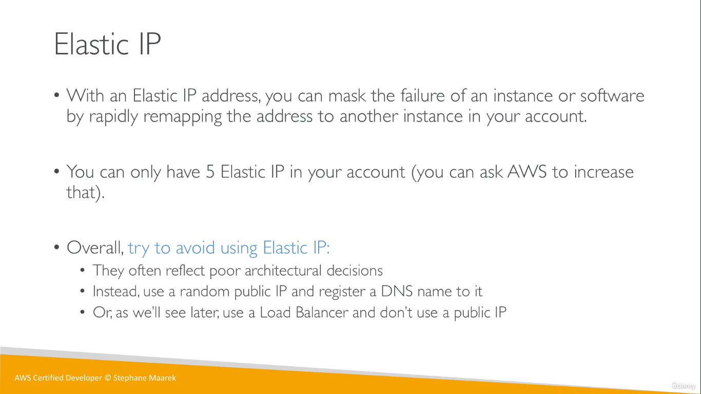  

## Placement Groups
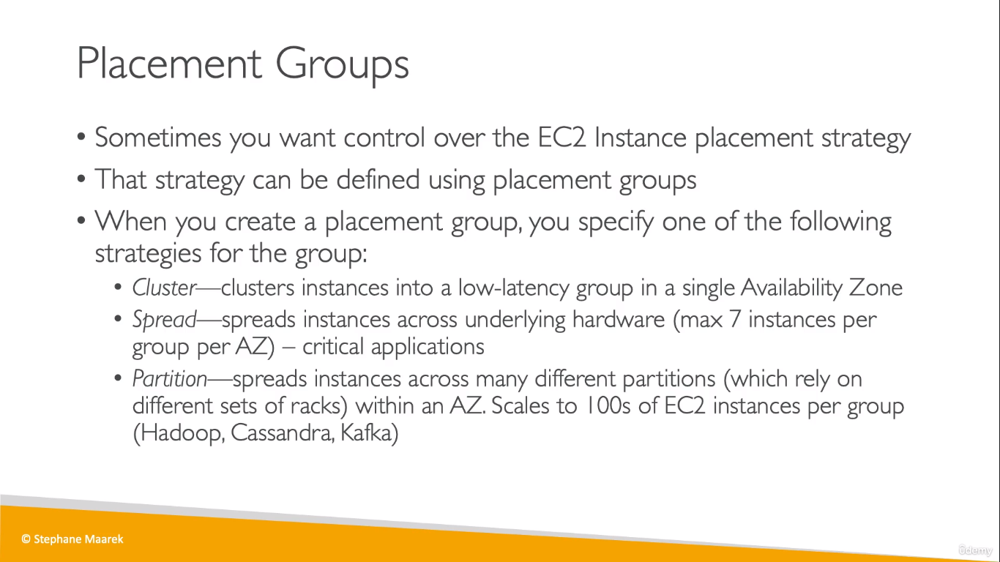  
  
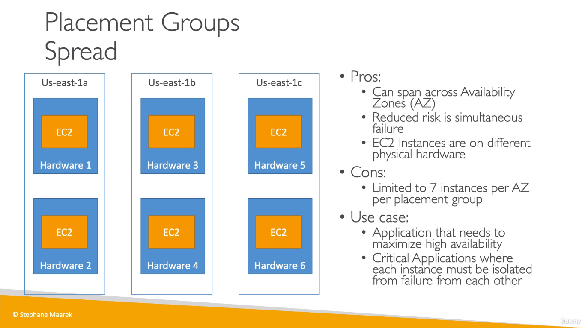  
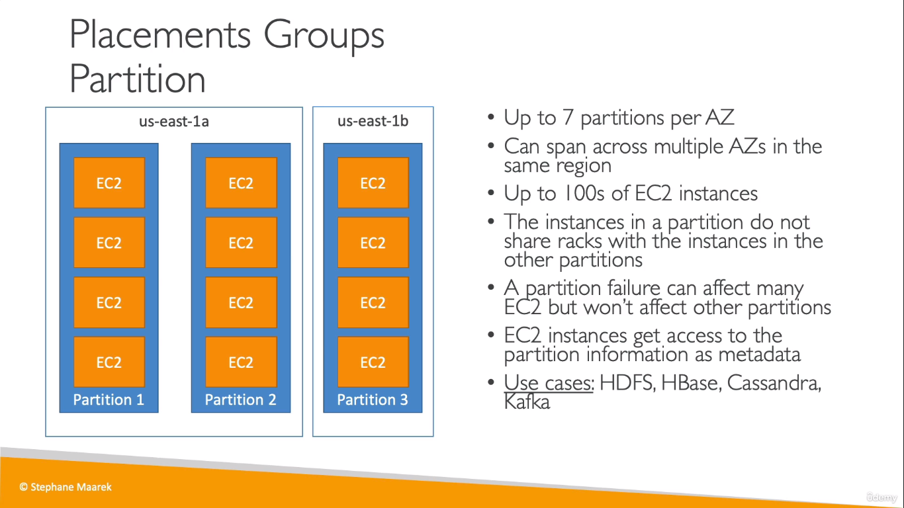  
* A maximum of 7 partitions can be chosen 

## Elastic Network Interfaces (ENI)
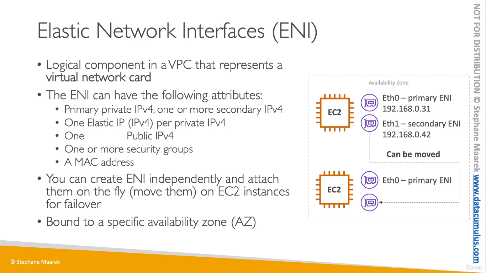  
* Read more [here](https://aws.amazon.com/blogs/aws/new-elastic-network-interfaces-in-the-virtual-private-cloud/).
    * launching an EC2 instance on a particular VPC subnet is effectively obsolete. A single EC2 instance can now be attached to two ENIs, each one on a distinct subnet. The ENI (not the instance) is now associated with a subnet.

## EC2 Hibernate
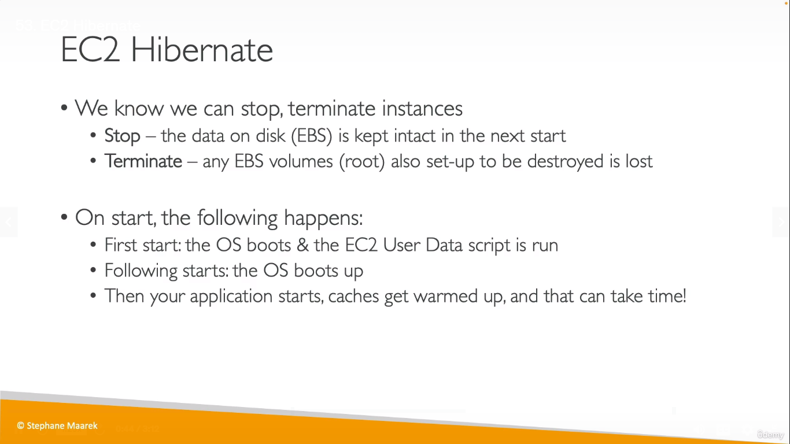
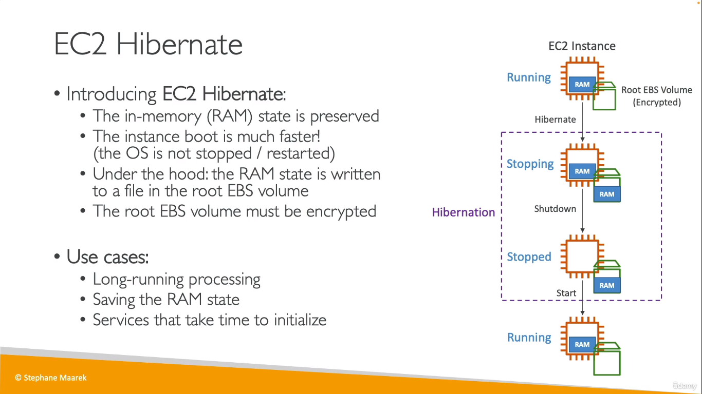  
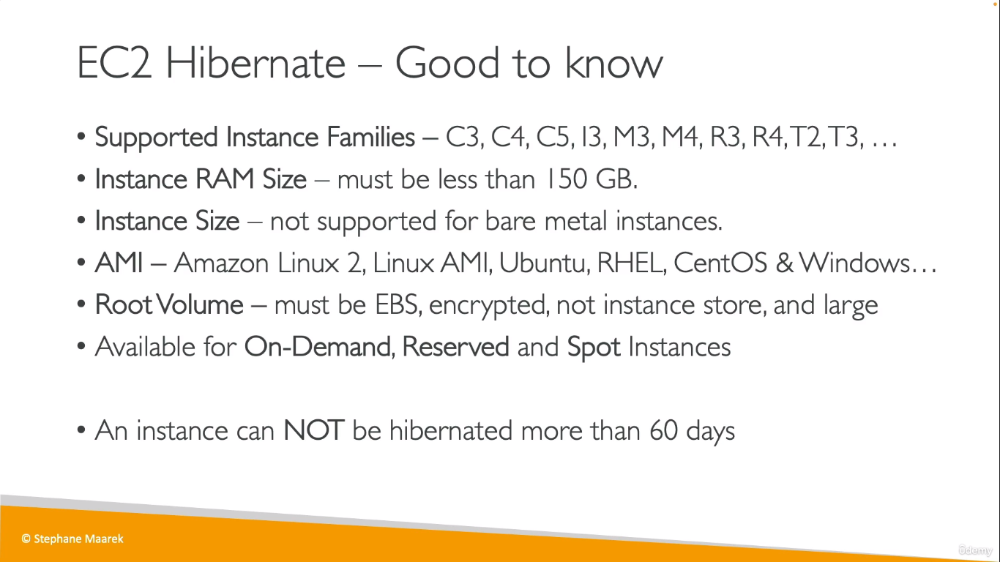  

## EC2 Nitro
* New virtualization technology

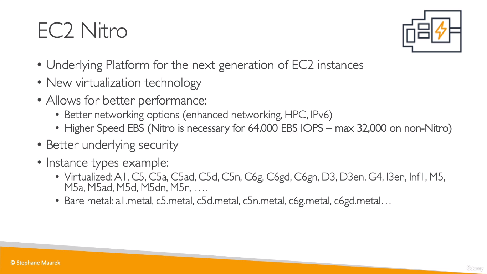  

## vCPU
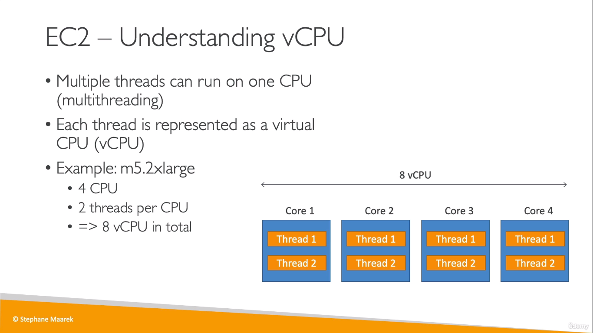  
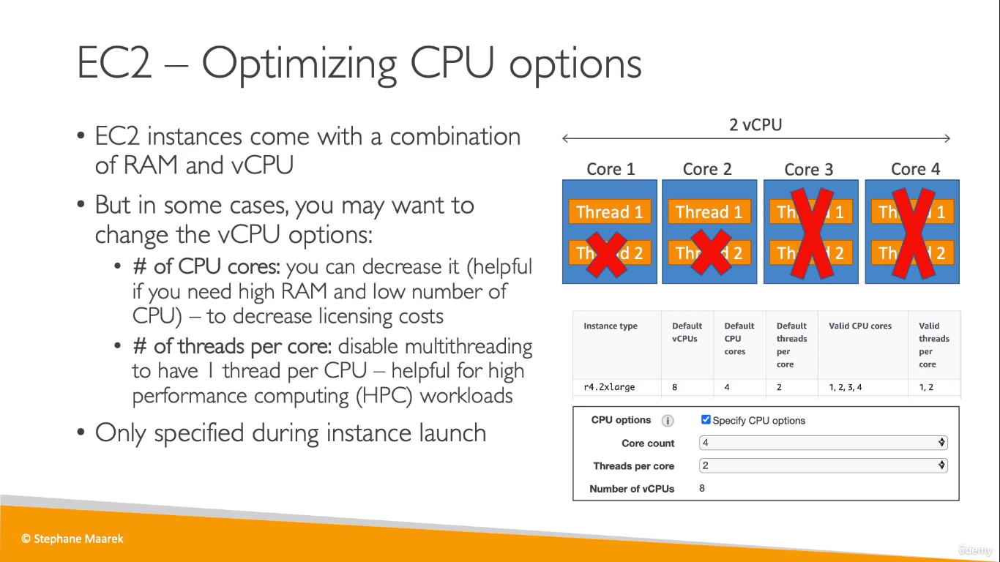  

## Capacity Reservations

  

## AWS EC2 Instance Metadata

* The URL is http://169.254.169.254/latest/meta-data
* SSH into the EC2 instance
* and use the `curl` command using the URL to obtain metadata bout the EC2 instance

## ELB vs ASG
* ELB uses its own health checks and it **balances the loads** it receives among the instances in the target group.
    * Incase of an unhealthy instance, new instances are not created. But the traffic is only routed to the healthy instances
* Whereas an ASG uses the health checks by ELB or default EC2 Healthchecks and is used to maintain horizontal scaling according to the scaling policy
    * If any unhealthy instance is detected, new instances are created by ASG